# ***Week 1: Principles and practices, Project Management***

## ***Exploring the World of Version Control***

The first time I used version control systems such as git, it seemed complex and time wasting for me at the beginning, but after I tried [github](https://github.com/) I changed my mind, specially when our Guru, Mr Fransisco stated that you can work from any computer even if it is not yours as you can download your files from internet and place them in your desktop which is called "cloning" and start editing them right away! On top of that he stated that you can automate all of these process which seemed interesting to me.

### ***Github***

To practice using github and to be familiar with it, we used it before the academy so we created an organization for our fablab as shown below:

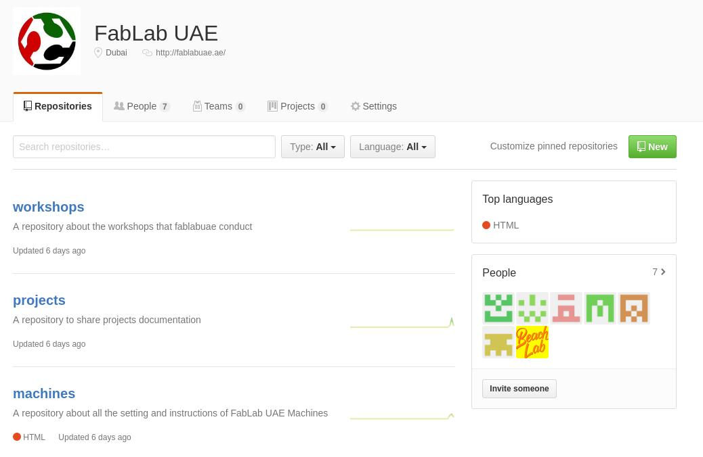

 and we created several repositories inside it such as machines and projects, the idea was to get familiar with github. And I want to mention that it is my first time to use linux, and I think I am going to use it for the rest of my life!

### ***GitLab***
This year Fabacademy documentation is based on GitLab which is similar to github but has other [advantages](https://www.upwork.com/hiring/development/gitlab-vs-github-how-are-they-different/). To start pulling and pushing, I needed to the following steps:

- Regisiter in [Fabacademy archive](http://git.fabacademy.org/users/sign_in) using my [fablabs.io](fablabs.io) account.
- Generate ssh key.
To generate ssh key, I needed to create ssh hidden directory inside my home directory
`mkdir .ssh` then I followed this [tutorial](https://help.github.com/articles/generating-a-new-ssh-key-and-adding-it-to-the-ssh-agent/) to generate the ssh key and to add my ssh key to the ssh-agent. To check that I successfully which is done via the following commands:

```
ssh-keygen -t rsa -b 4096 -C "uaefabtech@gmail.com"
eval "$(ssh-agent -s)"
ssh-add ~/.ssh/myid
```
- Adding my ssh key to my profile settings in the fabacademy archive

<p align="center">
   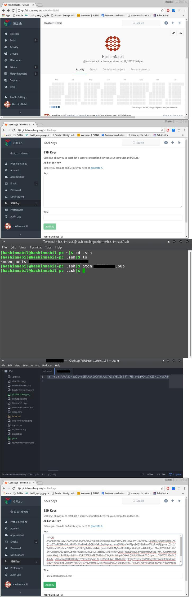
</p>

I covered my ssh key in black so no one can see it.

- cloning the lab archive to the assigned folder, I cloned the archive using ssh via the following commands:

```
cd Desktop/fablabuae
git clone git@git.fabacademy.org:fabacademy2017/fablabuae.git
```
As I am using manjaro linux, I needed to navigate to the folder where I want to clone the archive to, which is in this case, located in the desktop under the name of fablabuae
- Pulling and Pushing from and to the archive.

There are several steps that you need to follow to document using git version control system. Which are pulling, adding the changes, committing and finally pushing. These steps can be done using the following commands:
```
git pull
git add --all
git commit -m "message"
git push
```
`git pull`, downloads all the changes that other users made to the archive and it is a must before pushing anything to the archive. Then comes `git add --all` that adds all the changes that you made to the folder where the repository is cloned. Till this step you can easily discard the changes that you added by using `git reset` Then comes the `git commit -m "message"` which adds a signature message to each pushing operation you did, and it is recommended to write different message for each commit so you can get back to it anytime, and finally comes the `git push` which push all the changes you did to the repository.

And since I am documenting in markdown not directly on html, I needed to convert from markdown to html, to do that I used a command line tool called [Pandoc](http://pandoc.org/getting-started.html), which is very simple to use, all I needed to do to convert .md file to .html file so when I push it, it will appear as a webpage. The command is `pandoc index.md -f markdown -t html -s -o index.html` . At this stage, the documentation is nothing but raw html page. To style it I needed to use CSS template as advised by Mr Fransisco, so I used the [base.css](https://http://git.fabcloud.io/francisco/beach-lab-htgaa-2015/blob/master/students/sanchez.francisco/base.css) css styling which can be added during converting from markdown to html using the pandoc command, so my current workflow is:

```
cd Desktop/fablabuae
git pull
cd students/154
pandoc index.md -f markdown -t html -c mycss.css -s -o index.html
cd ~/Desktop/fablabuae
git add --all
git commit -m "message"
git push
```

Typing these commands is fine if you have only one page that you keep editing but if you have many linked pages like I do, then automating the pushing process is the best option as advised by Mr Fransisco Sanches, specially that I use markdown for documentation and I need to convert it to html later on. And this is what I exactly did after creating the website!

## ***Creating the Website***

 I used a free bootstrap HTML5 template to create this website as I don't have enough experience in HTML or CSS programming and I don't want to consume a lot of time learning them from scratch besides "Open Source is Love". The template I used is [Cyprass](https://shapebootstrap.net/item/1524990-cyprass-html5-responsive-business-template) from [ShareBoots](https://shapebootstrap.net/), It is one page template that I edited its source code using Atom text editor(for now, now = Tuesday, 31\1\2017, 6:20 pm) and I am using web browser to review the results after editing as Atom does not support live preview for HTML as for my knowledge, I tried searching online for an extension to have live preview in atom for HTML but I did not find thus I started editing the HTML source code of the template by Splitting the screen between atom and chrome to check the preview of the edited template, I had to save and refresh each time I want to see the edits. The picture below shows my work flow as for now (30 min from the previous "now"):

 <p align="center">
 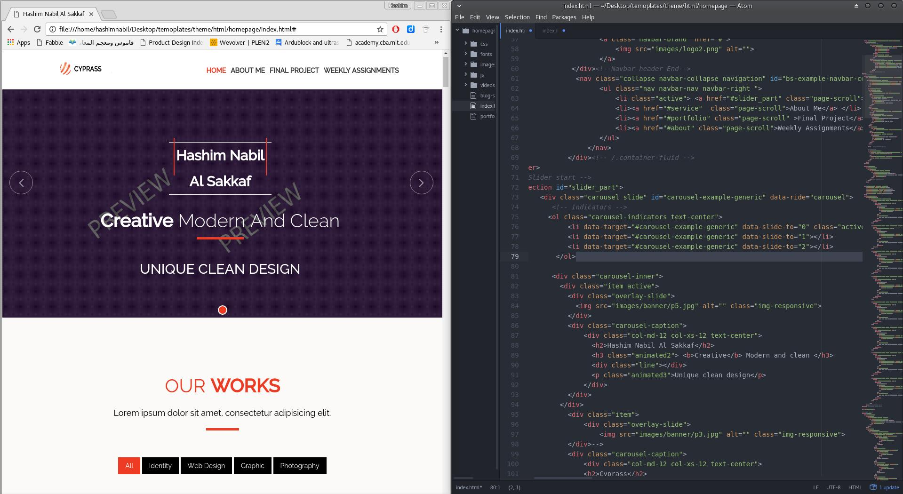
 </p>

 I was learning HTML on the go, as I used [W3Schools](http://www.w3schools.com/) website to learn HTML coding so I can edit the template source code for example, the below code was linked with logo of the template which was located at the top right of the page:

 <p align="center">
 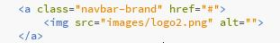
 </p>

As I am writing this documentation using Atom editor, and markdown mixed with HTML to make life easy, as I found that markdown is super easy and fast tool to write documentation in HTML but I still use some HTML commands to do things I don't how to do in markdown, as searching for HTML syntax is much easier and I always end up with what I am looking for, lets take the above picture as an example, I did not know how to center it in markdown and I searched and I found the answer in this [stackoverflow](http://stackoverflow.com/questions/12090472/github-readme-md-center-image) question so I just used raw HTML to do that as shown below:</p>
```
<p align="center">
   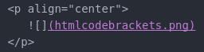
</p>
```
you will notice "brackets" up there, yes I download [brackets](http://brackets.io/) which is an open source text editor by Adobe, I also installed [Sublime Text](https://www.sublimetext.com/) and I was using all of them at the same time, I was using Atom for editing this page in particular as well as the HTML code of the template, while I used brackets for opening the original HTML code of the template so I can compare between it and the one I edited. It supposed to have live preview as shown in the picture below:

<p align="center">
   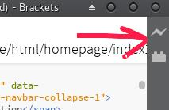
</p>

But I was getting Error Launching Browser, so I went to their [troubloshooting](https://github.com/adobe/brackets/wiki/Troubleshooting#-live-preview-isnt-working) page and found that restarting the computer might solve the issue, so I did and it did not solve the issue, then I tried the settings of the software and it turned that I need to check the option of "Enable Excremental Live Preview" as shown below:

<p align="center">
   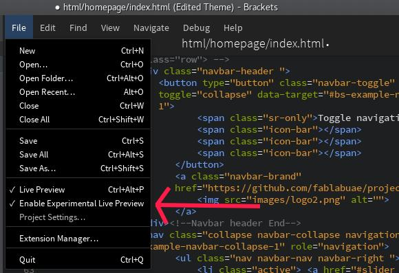
</p>

So I decided to use brackets for editing HTML codes such as the source code of the template as live preview proved to be quite faster as I don't have to press "ctr+s" then refresh the browser to notice the changes that I made in the HTML code, thanks to live preview! and In top of that, when you point at any place on the HTML code you will see the part that it controls highlighted in the live preview as shown below:

<p align="center">
   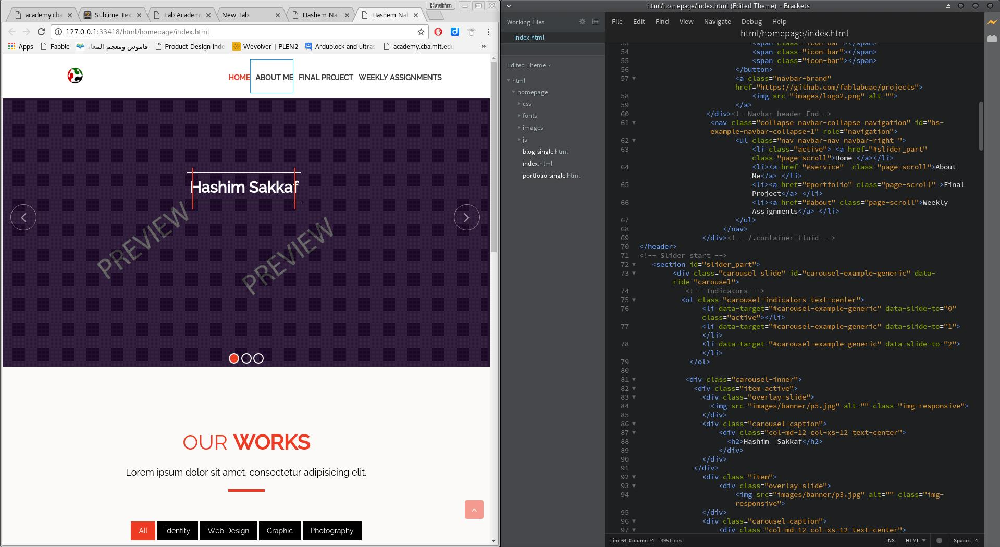
</p>

I was pointing at one of the tabs located at the top of the homepage "About Me" in the HTML code and I can see its location instantly in the live preview of the website, in the same way I can see the location of the section that I am pointing at the HTML code in the live preview of the website and this is quite useful, now I regret that I was using Atom for deleting the sections that I don't need from the template!

<p align="center">
   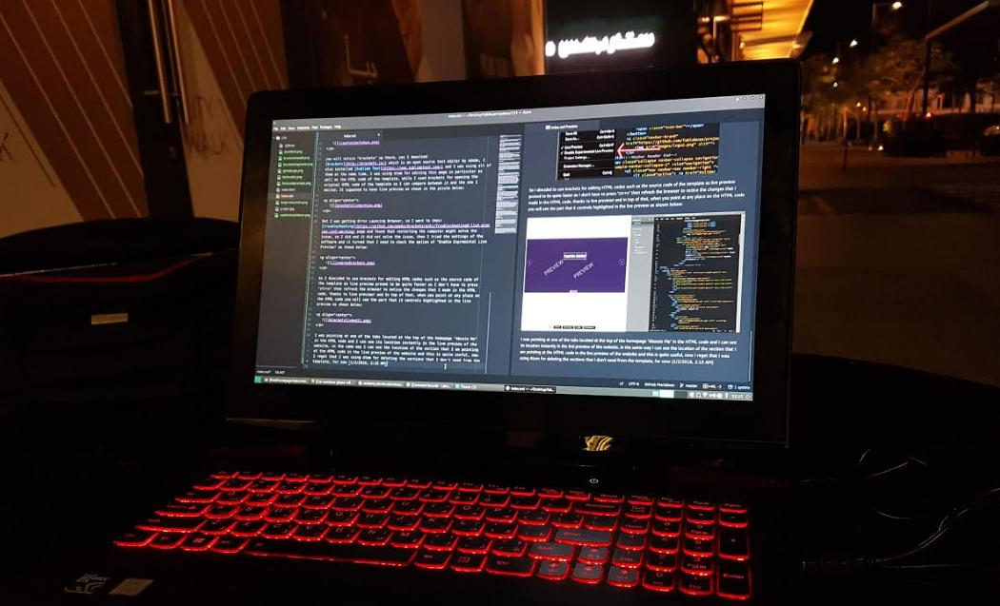
</p>

For now (1/2/2016, 2:15 AM), I experienced 3 text editors Atom, sublimetext and brackets and I think that I will be using Atom for creating HTML content (via markdown) and brackets for editing HTML as its live preview proved to be quite handy for me. For sublimetext, I did not notice a big different between it and Atom as some reviews concluded that sublimetext is better than Atom but I think the opposite is true, maybe I did not experience it a lot and I am not that good at both so I might change my mind in the future!

## ***Update: Final Template***

After spending couple of days with this template, I found it not flexible and not my type as I like straight forward and simple things when it is comes to a learning resources. So I used the [Fabacademy Template](https://github.com/openp2pdesign/FabAcademy_Template) by Massimo Menichinelli, it is simple to edit, modify and has direct and fast access to all the important pages which includes assignments and final project pages. So I will be using this template for now as I am learning a little bit of everything everyday so I might end up with creating my own template.

## ***My Final Workflow: Automation***

Working in Manjaro Linux was difficult for me at the beginning, but now I discovered the power of the command line, which is the super easy automation of any process and that is why our Guru Fransisco Sanchez "forced" us to use Linux. Since my website is having 4 main pages, the homepage, About Me page, Weekly Assignments page and the final project page and not to mention the 19 pages inside the weekly assignments page! so writing the commands manually will be time consuming!
I used [Nano](https://www.nano-editor.org/) text editor for creating bash shell commands function and I called it "push" that I can call anytime from the command line to perform the set of commands inside it and then I switched to Mousepad for editing bash shell commands as it is more user friendly. The function contains the following lines of code:
```
# This script automate the "Push" process to Fabacademy Archive (for Manjaro linux and windows 10)
# Done by Eng Hashim Nabil Al Sakkaf from FabLab UAE with help of Eng Francisco Sanchez from BeachLab
# To work directly it should be saved in the Desktop and the cloned archive should be saved in Desktop
if [ "$#" -gt 0 ]  # check for user comment
then
echo script to push to fablabuae repo
cd ~/Desktop/fablabuae/students
echo the folder size is:
size= du -sh 154  # check the size of the directory that will be pushed
read -p "file size is ok?" -n 1 -r  # ask the user to approve the size
if [[  $REPLY =~ ^[Yy]$ ]]
then
  echo converting markdown to html
  cd ~/Desktop/fablabuae/students/154
  for (( i=1; i<=19; i++))
  do
  cd ~/Desktop/fablabuae/students/154/week$i
  pandoc week$i.md -f markdown -t html -c mycss.css -s -o week$i.html  
  done
  echo pulling
  git pull
  echo Adding files
  git add --all
  echo committing
  git commit -m "$*"
  echo Pushing!!
  git pull && git push
  echo All set!
else
 echo change the size my friend
fi
else
echo commit please my friend
fi

# Hashim Nabil AL Sakkaf, 2017
# CC-SA-BY 4.0 License

```
So my pushing process is nothing but a single line of code now, whenever I want to push, all I need to do is to open the command line and write `push edited the homepage`, as this pushing function requires the user to commit due to the first `if else` condition, pushing operation will never happen unless a commit message is followed with the push function. The second `if else` remind the user with the file size of the directory so it is linked with a Yes/No user input choice that I obtained from this [tutorial](http://www.shellhacks.com/en/Yes-No-in-Bash-Script-Prompt-for-Confirmation) so if the user input was anything but `y` or `Y` the pushing operation will be terminated as well.

## ***Update: Auto Pushing Process from Windows!***

I use a lot of windows software such as Fusion 360, so I always had to take files, screenshots from windows then restart the computer to log in with linux so I can document and push. This proved to waste a lot of my time and I always be a situation when I need to re-take the screenshots, so I decided to push from windows as well and it has to be automated pushing process!

I am using windows 10 which is for my luck supports bash environment so I followed this tutorial from [howtogeek](https://www.howtogeek.com/249966/how-to-install-and-use-the-linux-bash-shell-on-windows-10/) to end up with having the Windows Subsystem for Linux (WSL).

<p align="center">
   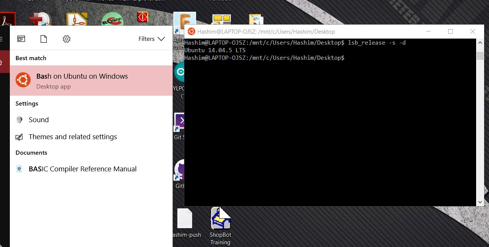  
   Ubunto on windows!!!
</p>

Then the first thing was installing Git, creating the ssh folder and trying to generate the shh key but I could not generate the ssh key successfully (there is a solution in this [page](https://superuser.com/questions/1111591/how-can-i-ssh-into-bash-on-ubuntu-on-windows-10) but I found it after successfully pushing with Git Shell, and I liked it!), so I installed the [Git for windows software](https://git-scm.com/download/win) which comes with the Git shell which uses windows Power shell. Then I did the following steps to prepare the environment for my pushing process.

1 - I started with creating the .ssh folder in my home directory.

<p align="center">
   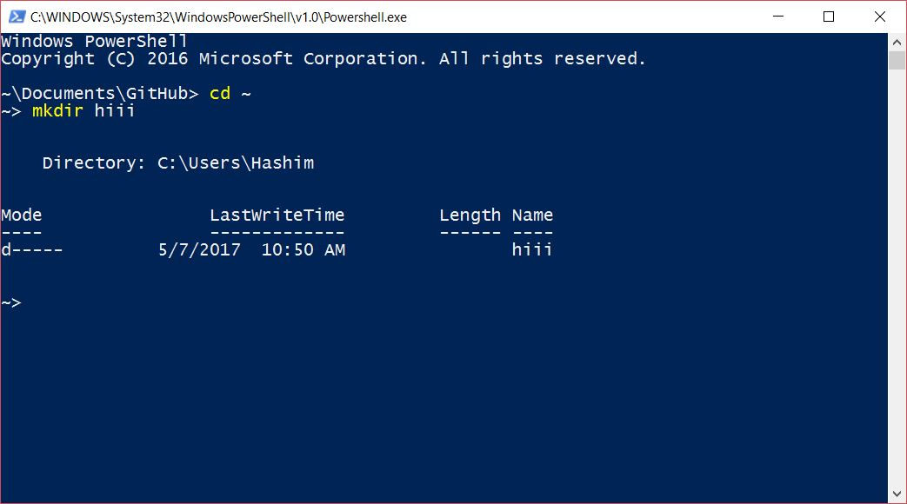  
   Instead of "hiii" write .ssh to create a hidden ssh directory.
</p>

  I did this documentation after genrating the ssh key so I created the "hiii" folder just to show you how to create a directory!  
2- Then I generated the local ssh key by following this [tutorial](https://help.github.com/articles/generating-a-new-ssh-key-and-adding-it-to-the-ssh-agent/#platform-windows).  
3- After that, I copied the local key by navigating to the .ssh folder and open the my_id.pup using any text editor then copying its content.  

```
cd .ssh
atom my_id.pup
```

The above script will open my key using atom text editor but you can open it with any text editor you prefer and copy the entire text within it.  

4- The last step was adding my local ssh key to our fabacademy archive page in GitLAB, to do so, I login using my [fablabs.io](fablabs.io) account and navigated to *Profile Settings>SSH Keys* and pasted the key and clicked *Add key*.  
With these steps, I am ready to clone the archive which is what I did, by navigating to our fabacademy archive page in GitLab and copying the ssh address. Then all I had to do is to navigate to the location where I want to clone, in my case I picked up the desktop as it is the same location for my fabacadey archive in linux, which will make my automation pushing process code work without any further edit! finally I wrote the following command:

<p align="center">
   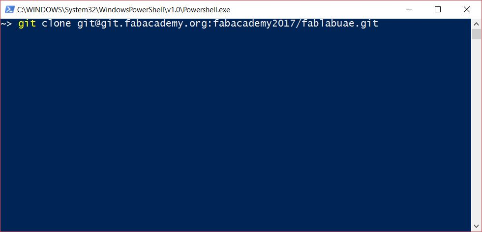  
</p>

Finally, I used my automated pushing process bash script which do the following:
1. Check for the folder size and ask for the confirmation of proceeding the pushing process to prevent the chance of pushing large size files to the archive.
2. Convert all the markdwon pages for all the weeks to html with the CSS styling.
3. Pull all the changes from the archive.
4. Adds all the changes I made.
5. Commit all the changes I made.
6. Push everything!

And all of that is done in only one command as shown below:

<p align="center">
   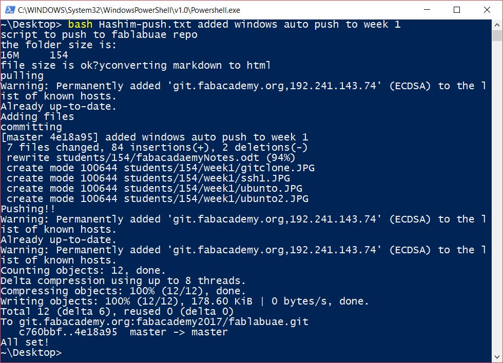  
</p>

## ***Final Words***

I am happy that I finalized my pushing process and you will notice that I made this documentation looks like a tutorial, this is because I want others to easily follow these steps and learn from them, and to be a reference for me in the future as I might end up teaching fabacademy. And I want to mention that some things seems difficult from the first look, but all you have to do is just ***start*** doing them!


<a rel="license" href="http://creativecommons.org/licenses/by-nc-sa/4.0/"></a><br />This work is licensed under a <a rel="license" href="http://creativecommons.org/licenses/by-nc-sa/4.0/">Creative Commons Attribution-NonCommercial-ShareAlike 4.0 International License</a>.
