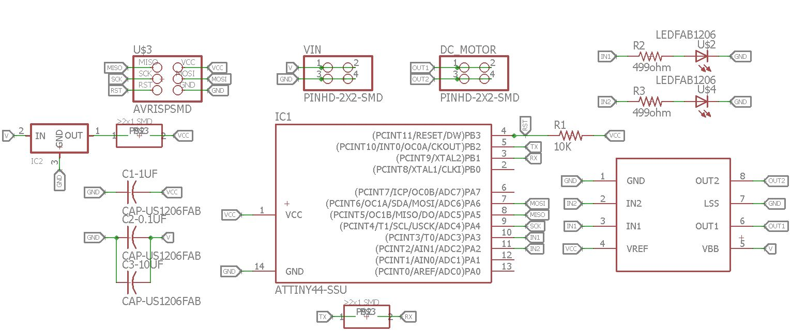
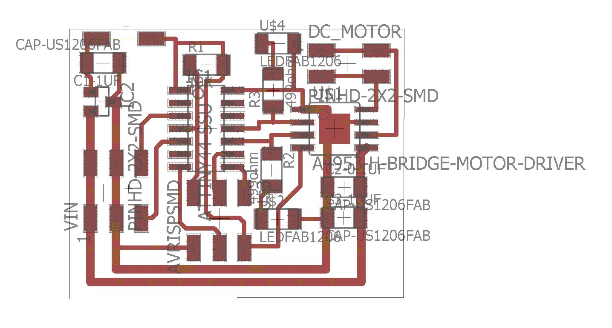
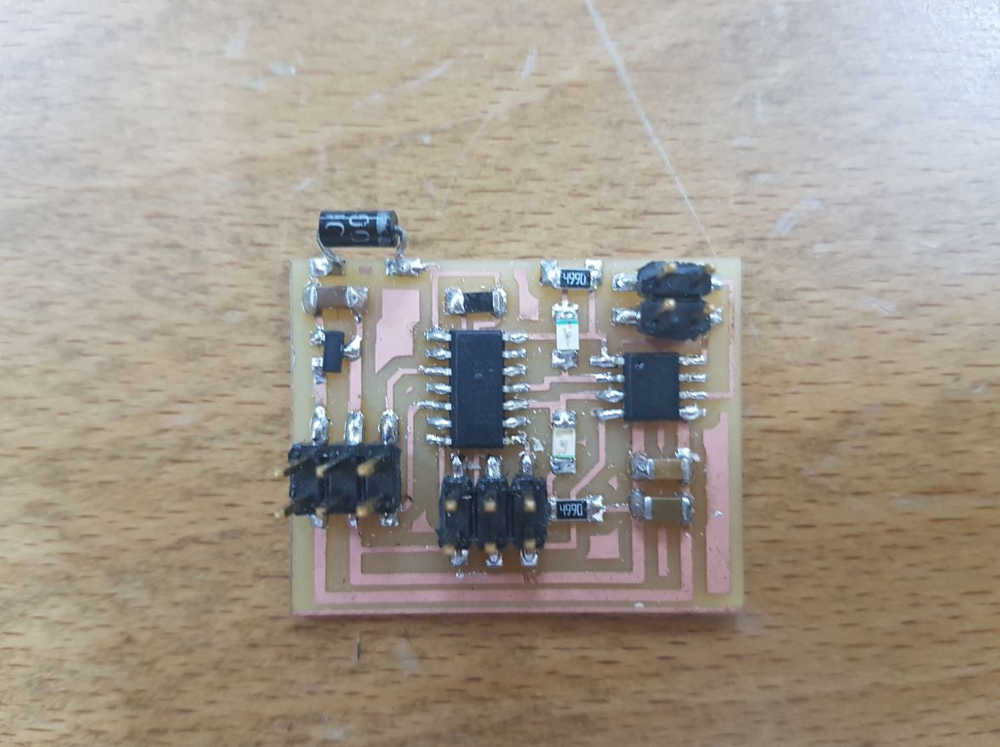
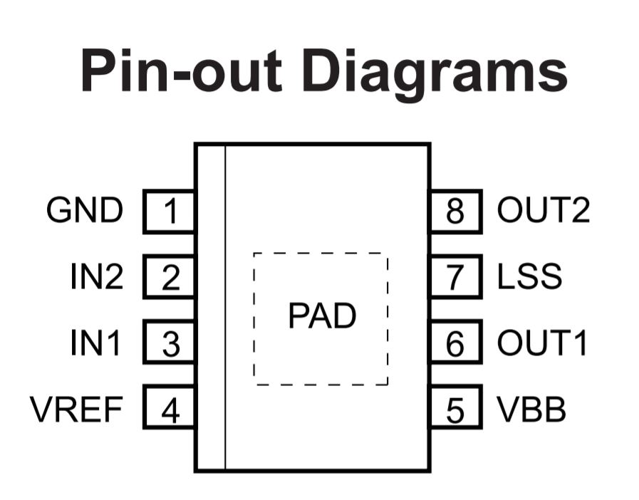
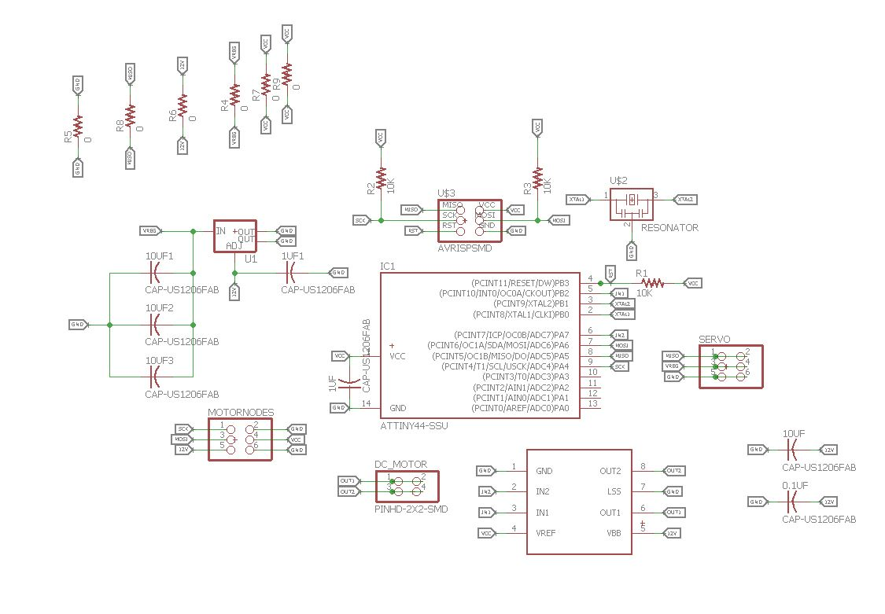
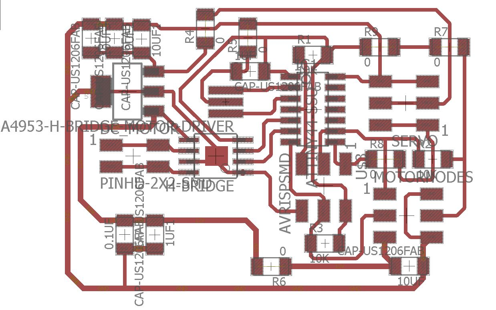
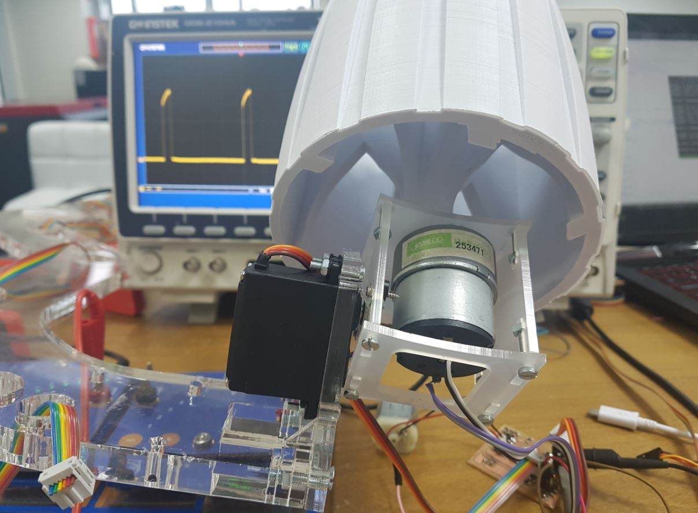

## ***Week 10: Output Devices***

### ***The Assignment***

For this week assignment, we need to control at least one output device. I decided to use DC motor as my output device.

### ***DC Motor***

I made a simple DC motor circuit that is based on Neil's [hello.H-bridge.44](http://academy.cba.mit.edu/classes/output_devices/H-bridge/hello.H-bridge.44.png) board. I made almost the same design but with eagle cad as shown below:

<p align="center">

</p>

<p align="center">

</p>

As seen from the above pictures, I added a diode that is connected to the regulator output and VCC of the Attiny44 because my colleagues faced an issue where the regulator is being burned because of overheat while programing the board as our Fab ISP programmer provide power to the boards to be programmed and the regulator is supposed to not get input power at its output pin. So the diode will prevent this issue.

<p align="center">

<center>The DC motor board after fabricating it</center>
</p>

The DC motor we used works with 12V and as any DC motor I tried before, its speed and power decrease with decreasing the voltage so normally we need analog output voltage to control the speed of the motor and we don't have that in the Attiny44. So here comes the [PWM](https://learn.sparkfun.com/tutorials/pulse-width-modulation) (Puls Width Modulation) that can generate different voltage levels out of a fixed DC voltage by controlling the frequency of the output pin.

Another important thing to consider is the direction control of the DC motor, as the spinning direction of the DC motor changes with changing the polarity of the motor terminals. To do this with software, an [H-Bridge](https://en.wikipedia.org/wiki/H_bridge) is needed which helps in reversing the polarity of the motor. I used to use the [L293d](http://www.ti.com/lit/ds/symlink/l293.pdf) H-Bridge with Arduino, but this time I used the (A4953)[http://fab.cba.mit.edu/classes/863.13/people/carney/p5/A4952-3-Datasheet.pdf] as it is the SMD type we have in the lab and is part of the FabLab inventory.

<p align="center">

<center>A4953 H-Bridge PINOUT</center>
</p>

As seen from the above image that I got from the datasheet of the A4953, it has two control pins `IN1` & `IN2` which are set as OUTPUTs as the motor direction will be as the following:

- Clockwise: `IN1 = HIGH` & `IN2 = LOW`
- Anti-Clockwise: `IN1 = LOW` & `IN2 = HIGH`


For programing, I used Neil's [code](http://academy.cba.mit.edu/classes/output_devices/DC/hello.H-bridge.44.DC.c) for the DC motor and modified it so the DC motor will spin only at one direction all the time, just for the sake of trying as it is based on software and I want to do a hardware PWM for my final project.

I attached the code [here](dc.c) and the below video shows the motor spinning:

I attached the code [here](dc.c) and the below video shows the motor spinning:


<center><iframe width="560" height="315" src="https://www.youtube.com/embed/N7U1vtwnPDI" frameborder="0" allowfullscreen></iframe></center>


### ***Final Project Output Board***

 I made the following board that is the node board of my final project that controls one DC motor and one servo motor for each wheel:

<p align="center">

</p>

<p align="center">

</p>

<p align="center">

</p>

FabRover, will have 6 of these nodes, one for each wheel. It is meant to control the speed and the direction of each wheel as each wheel has two degrees of freedom.

#### ***Servo***

At the beginning, I started with the servo. So I used [Neils's servo motor code](http://academy.cba.mit.edu/classes/output_devices/index.html) to control the servo using hardware PWM. He used PIN A6 and I needed to use PIN A5 so I just did this `#define PWM_pin (1 << PA5)` and expected it to work just fine but it did not! Then I went to the [datasheet](http://www.atmel.com/Images/Atmel-7701_Automotive-Microcontrollers-ATtiny24-44-84_Datasheet.pdf) (page 57, 97, 98 & 99) and found that I need to write to the `COM1B1` and `COM1B0` of the `TCCR1A` Timer/Counter1 Control Register A. So I changed the TCCR1A bits to be `TCCR1A = (1 << COM1B1) | (0 << COM1B0);` instead of `TCCR1A = (1 << COM1A1) | (0 << COM1A0);`. This is because Neil used `OCR1A` PWM output which is `PA6` and I needed to use `OCR1B` which is `PA5`. So I changed the settings of the `TCCR1A` register.


And As per the [ Tower Pro MG996R servo](http://www.electronicoscaldas.com/datasheet/MG996R_Tower-Pro.pdf) datasheet  which the servo I used, I need to generate a PWM signal with a frequency of 50 HZ, and because I used `Phase Correct PWM Mode` with `ICR1` as top value and the frequency in this mode is calculated as the following:
f= fclok/(2xprescaler)  
 and with 20MHz the results will be 1250000 and to get 50 I need to use ICR1 with 25000 so 1250000/25000 = 50.

Then the servo needs 1 ms, 1.5 ms and 2 ms PWM signals to go to 60, 0 and -60 degrees. I used the same values of OCR1A of Neil's servo example, but for OCR1B.

The below image shows the setup I used to test the servo on one of the wheels of the FabRover:

<p align="center">

</p>

The below video shows the servo motor working:

<center><iframe width="560" height="315" src="https://www.youtube.com/embed/kVEku1P4qcI" frameborder="0" allowfullscreen></iframe></center>

As seen above, I used the oscilloscope to show the PWM signals in real time while controlling the servo.

#### ***DC & Servo Together!***

After getting familiar with the hardware PWM modes of the attiny44, I decided to control the wheel servo and dc motor using 3 hardware channels as the following:

- Servo motor PWM channel
  - Connected to `PA5`
  - Driven by `OC1B` PWM channel of Timer 1.
  - ICR1 at top, Phase correct PWM mode.

- DC Motor Channel 1 &2
  - Connected to `PA7` & `PB2`
  - Driven by `OC0A` & `OC0B` PWM channels of Timer 0.
  - 0xFF at top, Fast PWM mode.

  So I started by configuring the Timer 1 and Timer 0 registers as the following:

```
// Servo Setup
  // set up timer 1
  //
  TCCR1A = (1 << COM1B1) | (0 << COM1B0); // clear OC1B on compare match
  TCCR1B = (0 << CS12) | (1 << CS11) | (0 << CS10) | (1 << WGM13); // prescaler /8, phase and frequency correct PWM, ICR1 TOP
  ICR1 = 25000; // 20 ms frequency
  // set PA5 as output
  DDRA |= (1 << PA5);
  // intilize PA5 to 0
  PORTA &= ~(1 << PA5);
//-----------------------------------------------------------------------------------------------------------------
  //  
  // DC motor setup
  // set up timer 0
  //
  // clear OC0A & OC0B on compare match
  TCCR0A = (1 << COM0A1) | (0 << COM0A0) | (1 << COM0B1) | (0 << COM0B0) | (1 << WGM01) | (1 << WGM00);
  // prescaler /8, Fast PWM Mode, 0xFF Top
  TCCR0B = (0 << CS12) | (1 << CS11) | (0 << CS10) | (0 << WGM02);
  // intilize DC motor PINS to 0 (IN1 & IN2)
  DDRA |= (1 << PA7);
  PORTA &= ~(1 << PA7);
  DDRB |= (1 << PB2);
  PORTB &= ~(1 << PB2);
```

Then I created 5 functions for controiling the speed and direction of the DC motor as well as the position of the servo as shown below:

```
// function difentions

  void left (void) // left postion -60 degrees
 {
  // 1.5 ms PWM on time
  //
  OCR1B = 1250;

  //
 }
  void mid (void) // mid postion 0 degree
 {
  // 1.5 ms PWM on time
  //
  OCR1B = 1875;

  //
 }
  void right (void) // right position +60 degrees
 {
  //
  // 2 ms PWM on time
  //
  OCR1B = 2500;
  //
 }

 void dcc (int v) // turn DC motor Clockwise with a given speed
 {
 OCR0B = v;
 PORTB &= ~(1 << PB2);
 }

 void dca (int v) // turn DC motor Anti-Clockwise with a given speed
 {
      OCR0A = v;
      PORTA &= ~(1 << PA7);
 }

```

With this I can control the DC motor speed and direction as well as the servo with hardware PWM so I can make them move in the same time independtly!!! All I have to do is to call these function inside the infinite while loop. The below videos shows controlling the wheel DC motor and servo for one and two wheel respectively.

<center><iframe width="560" height="315" src="https://www.youtube.com/embed/sjJATa7n2iU" frameborder="0" allowfullscreen></iframe></center>


<center><iframe width="560" height="315" src="https://www.youtube.com/embed/a0TyPQi151g" frameborder="0" allowfullscreen></iframe></center>


### ***This Week's Files***

* [Week Files](week10.tar.gz)
