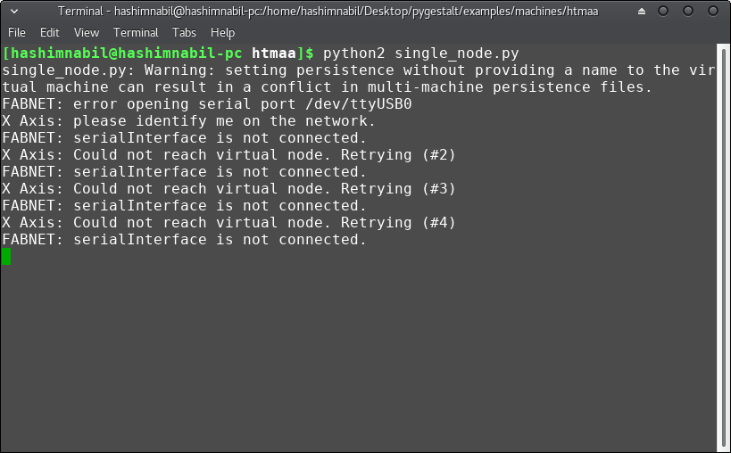

## Week 11: Machine Design

The folder of the group machine assignment can be found [here](http://archive.fabacademy.org/2017/fablabuae/machine.html).

## My Contribution

I was responsible for the programing of the machine and making the documentation of the group, as our machine is based on (reconfigurable stages) of Nadya Peek, we used 4 nodes of gestalt board. I started learning how to use them by following this nice [tutorial](http://fabacademy.org/archives/2015/doc/MachineMakingNotes.html). I connected the FabNet board along with one stepper motor connected and ran the single_node.py code. At the begining I was having error as the USB port was not connected as shown below:

   

The problem was the USB port as it was not having the permesion to be used via the python code so I ran it with sudo and it worked just fine.

I tested the codes and managed to make two motors work at a time.

I used the example of the simple xy plotter of the htmaa folder inside the examples of pygestalt. I managed to make two motors move as shown in the below video:

[Video of two nodes working](video.mp4)

Then we ran out of time due to the other tasks we have to do beside fabacademy and we used pygestalt to conrol only the extruder of the machine and the Arduion GRPL firmware to conrol the X,Y and Z axes of the machine.

### ***Files of the Week***

- [Machine Programing](machine.tar.gz)
