## ***Week 13: Input Devices***

### ***The Task***

To design a circuit board that is connected to an input device and read it and display the readings.

### ***Hacking attempt!***

As my final project requires rotary feedback, I will need the rotary encoder to read the feedback of the motors. I started by disassembling an old printer's motor that is connected to a rotary encoder as shown below:

<p align="center">
   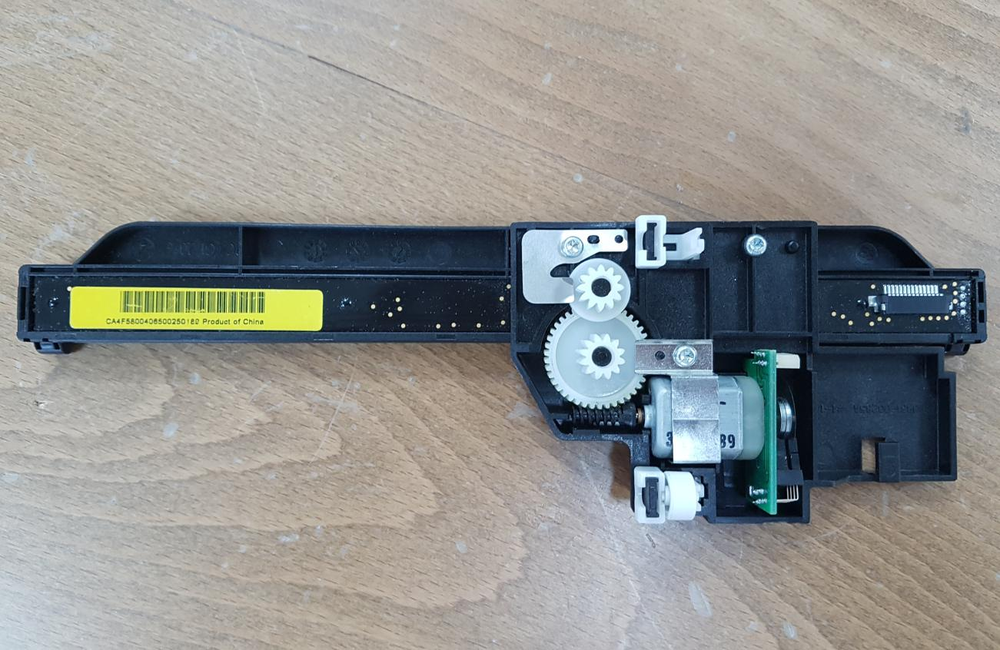
</p>

<p align="center">
   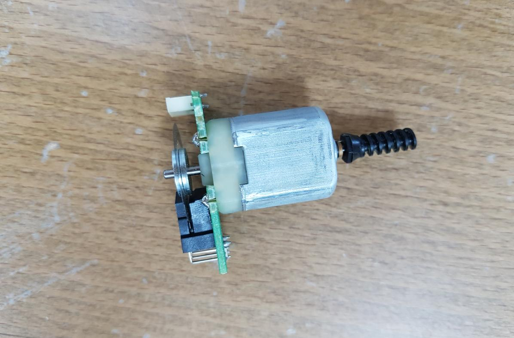
</p>

While powering the circuit, I shorted the encoder circuit by mistake and the IR photodetector burned out! so I dropped this idea.

### ***Rotary Encoder Design***

After my failed attempt, I decided to create the sensor my self specially that we have the main components required to create it. The rotary encoder consists of the encoded disk, the IR LED and the photo transistor.

#### ***Encoder Disk***
 I made the Encoded disk using [WheelEncoderGenerator](https://code.google.com/archive/p/wheel-encoder-generator/) software which is shown below:

<p align="center">
   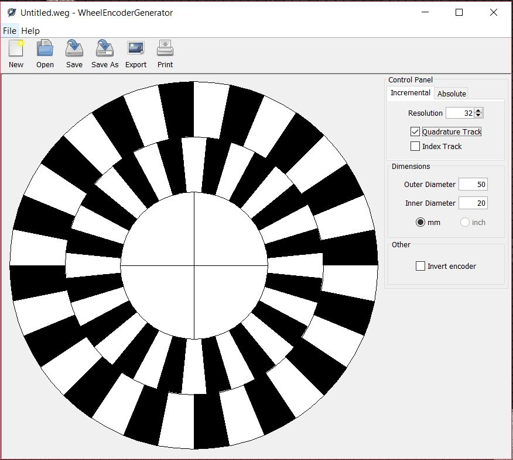
</p>


#### ***IR LED and Photodarlington***

IR LED is Infra RED Light Emitting Diode that I dealt with before, I used it with IR Receiver ([photo diode](https://en.wikipedia.org/wiki/Photodiode) or [photo transistor](http://www.radio-electronics.com/info/data/semicond/phototransistor/photo_transistor.php)). However, the Photodarlington was new term to me so I looked it up in the internet and found it to be a darlington transistor having a phototransistor as input as per [this](https://en.wiktionary.org/wiki/photodarlington) Wiktionary article. The [darlington transistor](htt ps://en.wikipedia.org/wiki/Darlington_transistor) consists of two bipolar transistors connected in a way that the total current gain is the product of the gains of both transistors. The model I used is [Silicon Photo Darlington in PLCC-2 Package OP580DA](https://www.digikey.com/product-detail/en/tt-electronics-optek-technology/OP580DA/365-1481-1-ND/1853400).

<p align="center">
   
</p>

It has 2 pins which are the collector and the emitter as shown in the figure below:

<p align="center">
   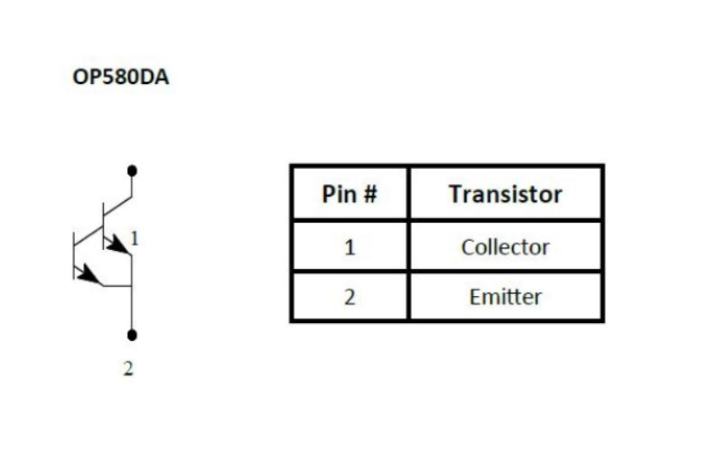
</p>

This photodarlington has 100% relative response at wavelength of 900 nm which is good for me as we have [IR LED](https://www.digikey.com/product-detail/en/everlight-electronics-co-ltd/HIR11-21C-L11-TR8/1080-1346-1-ND/2676080) with maximum relative intensity at wavelength of 850 nm, and according to the photodarlington datasheet, the relative response will be almost 90% at 850 nm.
<p align="center">
   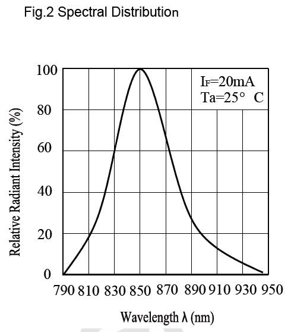
   IR LED Spectral Distribution graph
</p>

<p align="center">
   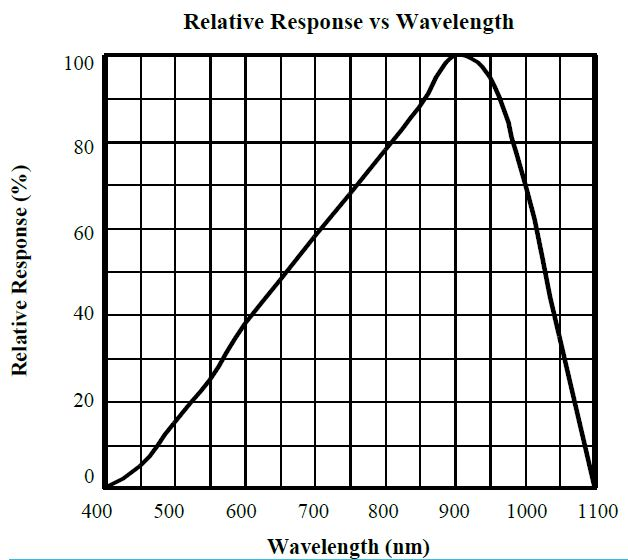
   IR LED Spectral Distribution graph
</p>

### ***PCB Design***

I used Neil's [hello.reflect.45](http://academy.cba.mit.edu/classes/input_devices/) board as reference to my board design.

<p align="center">
   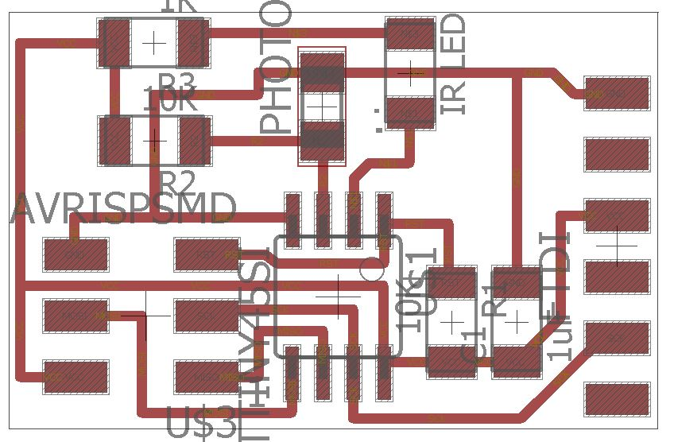
</p>

However I designed two separated small PCBs for the IR LED and the photodarlington so I can mount them opposite to each other.

<p align="center">
   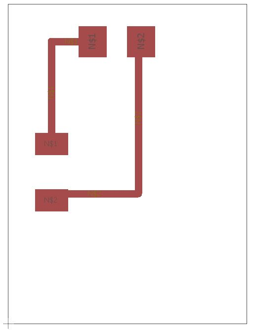
</p>

Then I milled them and connect the pads to the main board as shown below:

<p align="center">
   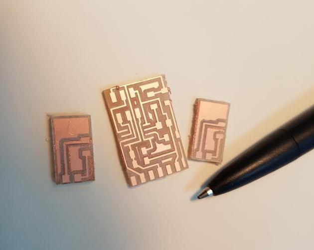
</p>

<p align="center">
   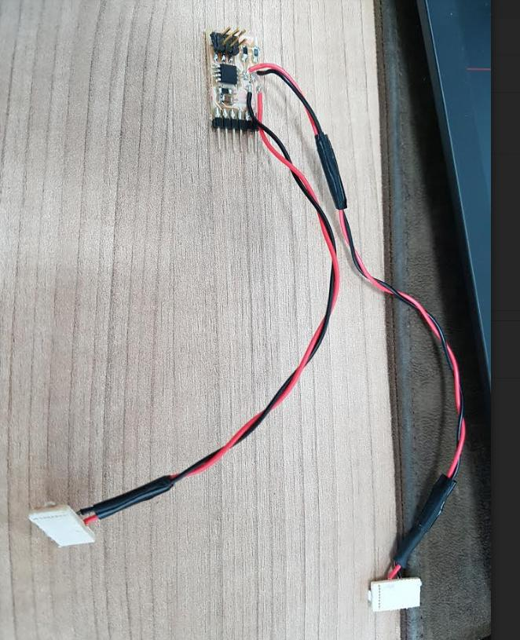
</p>

#### ***PinOut***

<p align="center">
|Component               |Pin        |
|------------------------|-----------|
|IR LED                  |PB3        |
|Photo Darlington        |PB4        |
</p>

### ***Programming***

#### ***Testing the IR LED***

The first thing I did was testing the IR LED. I wrote a simple [IR_Blink](IR_Blink.c) program to blink the IR for half second. I used my phone to check the results as we, humans can see IR light! The below video shows the IR LED blinking:

<p align="center">
<iframe width="560" height="315" src="https://www.youtube.com/embed/sSoYvxSseOc" frameborder="0" allowfullscreen></iframe>
</p>

#### ***Reading the Photodarlington***

As the photodarlington is outputting analog data, I will have to use the Aanalog to Digital Convertor (ADC) to read the values. I experienced that before with Arduino, analogRead() function but now I need to do it from scratch with C.

As I am using Attiny45, I went to the [datasheet](http://www.atmel.com/images/atmel-2586-avr-8-bit-microcontroller-attiny25-attiny45-attiny85_datasheet.pdf) to check for the ADC hardware. And it turned to be that is has 10 bit ADC that has its own clock for more accurate readings. The Analog Digital Convertor documentation starts from page 122 of the datasheet. I was reading it and comparing it with [Neil's Hello_light](http://academy.cba.mit.edu/classes/input_devices/light/hello.light.45.c) code of the input devices to have a better idea about it.

##### ***Conifguring the ADC***

After reading Neil's code, [Simply_AVR Book](http://librebooks.org/simply-avr/) , Attiny45 datasheet ADC convertor section, and watching this amazing [tutorial](https://www.youtube.com/watch?v=sVvDiACf3yE), the ADC can be configured as the following:  


  1- **Enabling the ADC**  
  `ADCSRA |= (1 << ADEN);` We can configure that by writing to the ***ADC Control and Status Register A ADCSRA***.

  <p align="center">
  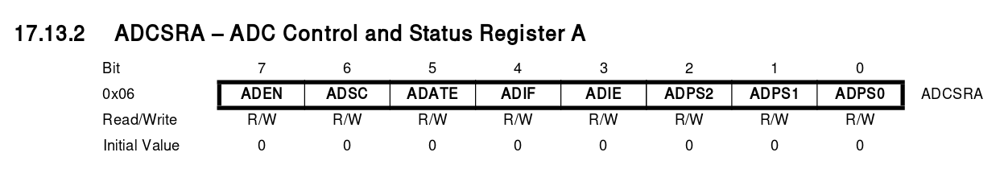
  </p>

  2- **Setting up the prescaler** ```ADCSRA |= (1 << ADPS2) | (1 << ADPS1) | (1 << ADPS0);```  
  According to the datasheet, the ADC requires an input clock frequency between 50 kHz and 200 kHz to get maximum resolution. The lower the better.

  <p align="center">
  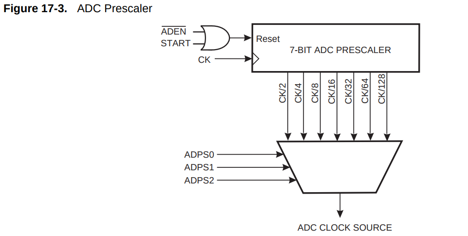
  </p>

  The prescaler can be set by configuring the ADPS0, ADPS1 and ADPS2 bits of the ADCSRA register as shown in the below table:

  <p align="center">
  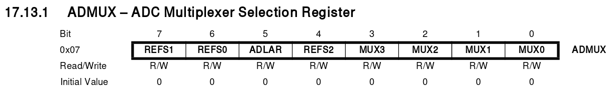
  </p>

In my case, I will use 128 just as Neil's example as I also use the 8 MHz clock. so the ADC will be running at 8MHz/128 = 62.5 KHz.  
3- **Configuring the reference voltage.**
`ADMUX |= (0 << REFS2) | (0 << REFS1) | (0 << REFS0)` this will set the reference voltage to VCC. The voltage reference can be external, VCC or internal with specific values and can be configured by writing to the ***ADC Multiplexer Selection Register ADMUX*** as shown in the table below:

<p align="center">
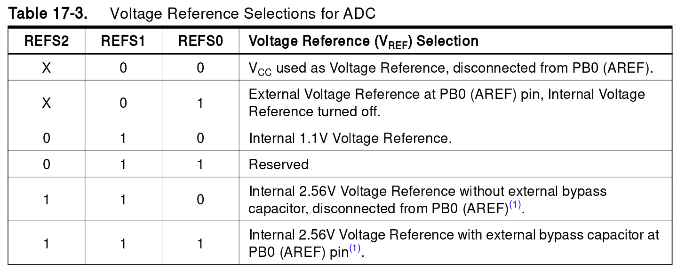
</p>


4- **Configuring the presentation of the ADC conversion result in the ADC Data Register**. According to the datasheet, if `1` is written to the ADLAR bit, the ADC result will be left adjusted, while writing `0` will make it right adjusted. Neil made it right adjusted by using `ADMUX |= (0 << ADLAR)`. This is because the ADC in attiny45 is 10 bit and each register is 8 bit maximum so the ADC result takes 2 registers to fit the data which are ADCL and ADCH.

<p align="center">
   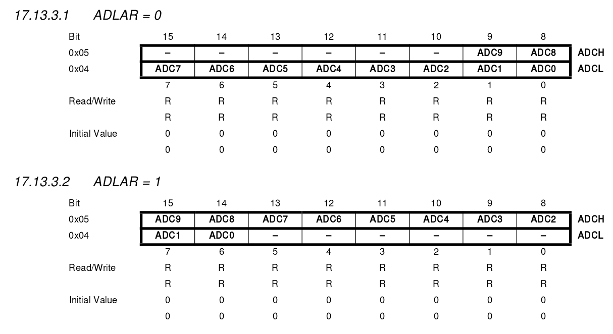
</p>


5- **Selecting the ADC channel.**  
`ADMUX |= (0 << MUX3) | (0 << MUX2) | (1 << MUX1) | (0 << MUX0);` this will set the ADC channel to ADC3 or PB4 which is the pin that is connected to the photodarlington.  

<p align="center">
   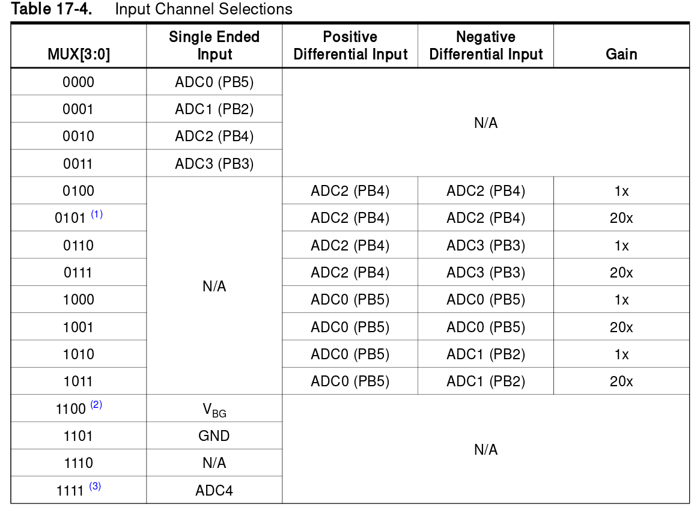
</p>

***Note: All of the above configuration are done in the main() function***

##### ***Using the ADC***

Using the ADC is much simpler than configuring them and of course it happens in the endless while loop.

1- **Starting the conversion process** `ADCSRA |= (1 << ADSC);` writing 1 to the ADC Start Conversion ADSC bit will start the ADC conversion process.  

2- **Waiting for the conversion process to finish** `while (ADCSRA & (1 << ADSC));`

3- **Using the ADC Low and High Values ADCL & ADCH**  
As Fransisco said, the `#include <avr/io.h>
` allow us to use the registers, pins and everything inside the avr microcontroller with names! so we can use the ADC results ADCL & ADCH by just typing them. In Neil's example, he send them to the serial port. He started by the ADCL then the ADCH.

### Update: No more Encoder!

After going this far, I understood how the ADC convector inside the attiny works, and as I changed the final project from anyAxes to FabRover, I don't need the encoder anymore and I think it will be a waste of time. So I made a new circuit board that has an LDR and supports I2C and serial connection. I also added LED to it to clear this week assignment. The LED will turn on when there is little or no light at the room. This time I used simple `ADC` command instead of `ADCH` and `ADCL` that Neil used. I also used the PA0 which is ADC0 channel and according to the datasheet, I don't need to set the ADMUX register as leaving its vlaues to zero means that the refereance volatge will be VCC and the ADC channel will be ADC0.

I designed the main board using Eagle CAD. It is based on attiny44 and I did not use attiny45 because two ADC pins of the 3 ADC pins that it has are meant for the external crystal and the third ADC pin is meant for the SCK of the I2C pins so no more ADC pin to use and that is why I switched to attiny44. The below image shows the board design and the fabricated version:

<p align="center">
   
</p>

<p align="center">
   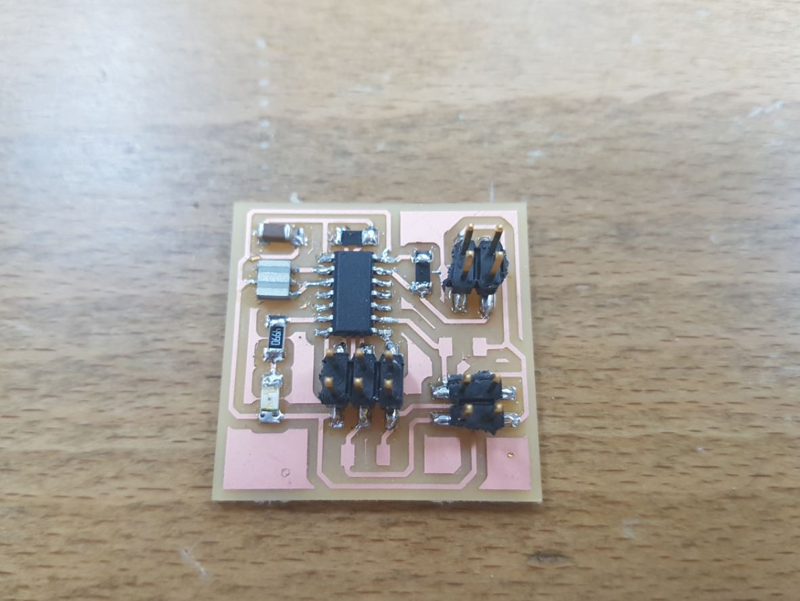
</p>

Then I used Kokopeli to design a breakout for the LDR so I can mount it at the top of the Fab Rover while all the electronics are mounted inside the Fab Rover.

<p align="center">
   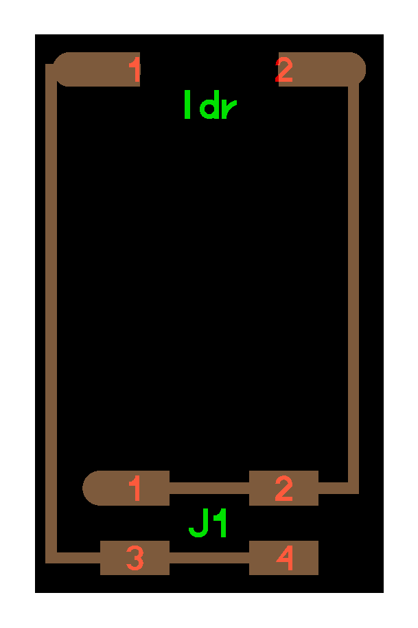
</p>

<p align="center">
   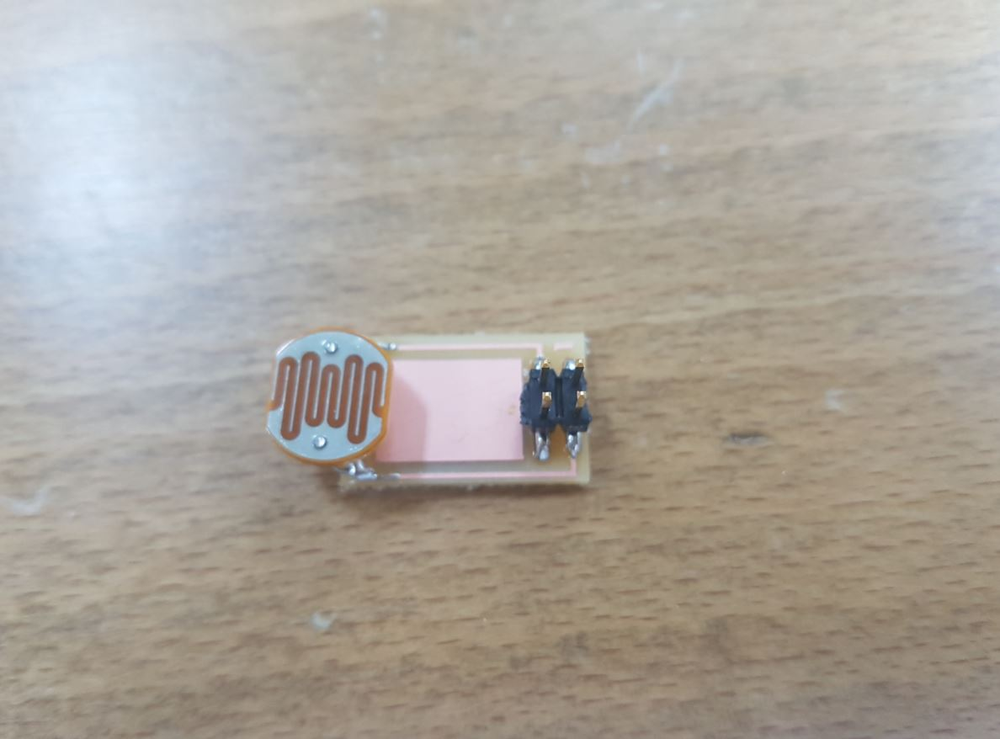
</p>


The setup I used for this week assignment can be shown below:

<p align="center">
   
</p>

The below video shows the board working:


<center><iframe width="560" height="315" src="https://www.youtube.com/embed/V_LCW3ic8yY" frameborder="0" allowfullscreen></iframe></center>

Finally, I am thinking of using the LDR as the input of my final project, so when the light level is low, all the motors should stop moving.

### ***Files of the Week***

- [encoder.sch](encoder.sch)
- [encoder.brd](encoder.brd)
- [IR and Photodarlington Pads shcematic](pad.sch)
- [IR and Photodarlington Pads board](pad.brd)
- [LDR.sch](LDR.sch)
- [LDR.brd](LDR.brd)
- [LDR.c](LDR.c)
