## ***Week 14: Composites***

This week assignment requires us to ready the material safety datasheet and the technical datasheet of the resins that we are going to use and to design and fabricate a 3D mold and make a composite out of it.

### ***Mold Design***

I used Fusion 360 to design the mold. It is a semi sphere mounted on the top of thin box and has the letter "H" at the top.

  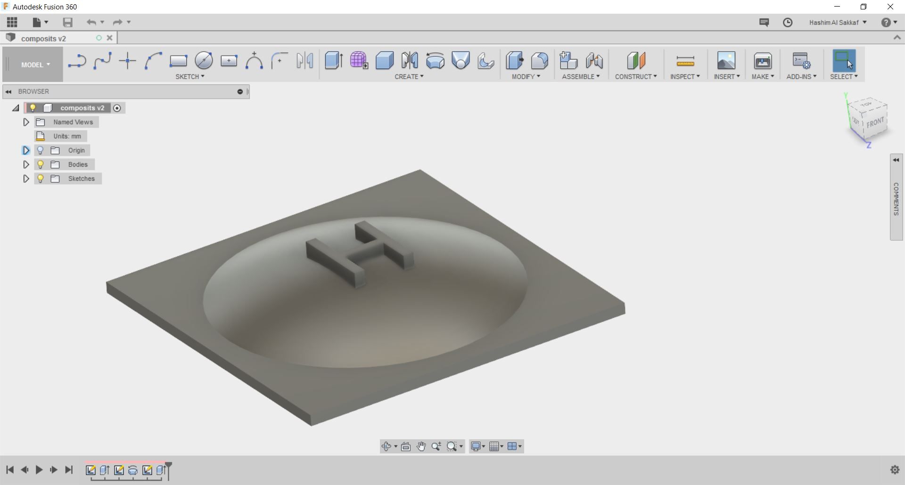   
  
Final board

I considered the height of the blue foam that we have which is 5 cm so the height of my mold is also 5 cm so I will need only one piece of foam to fabricate the mold.

### ***Mold Fabrication***

First I exported the STL file from fusion360 then I opened it in VCarv Pro- ShopBot Edition. I made the working area to be 400 x 400 mm and thickness to be 50 mm which is the same thickness of the foam.

Then I made the first tool path which is the roughing toolpath with a spindle speed of 12000 RPM, 0.5 inch of stepover and a crazy feedrate speed of 150 mm/s. Well it was the time that we need to go out to have breakfast and it was foam after all so why not!

  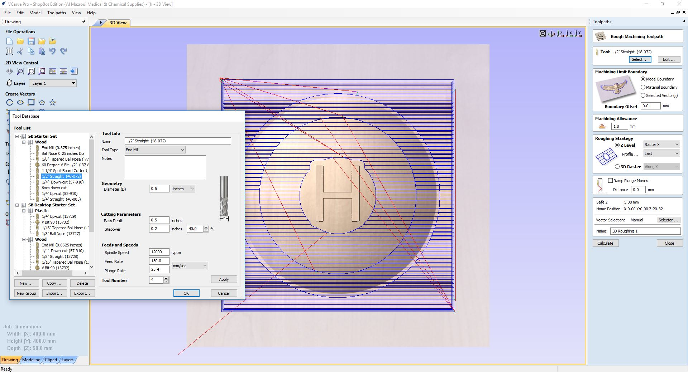   
  
Roughing Toolpath Settings

The below video shows the beginning of the roughing operation with the super fast feedrate speed!

<iframe width="560" height="315" src="https://www.youtube.com/embed/GqQrPLAW22g" frameborder="0" allowfullscreen></iframe>
  

The second toolpath was the finishing toolpath which I used the 1/4 inch ball nose bit with a spindle speed of 12000 RPM, 0.1 inch of stepover and the same super fast 150 mm/s feerate speed.

  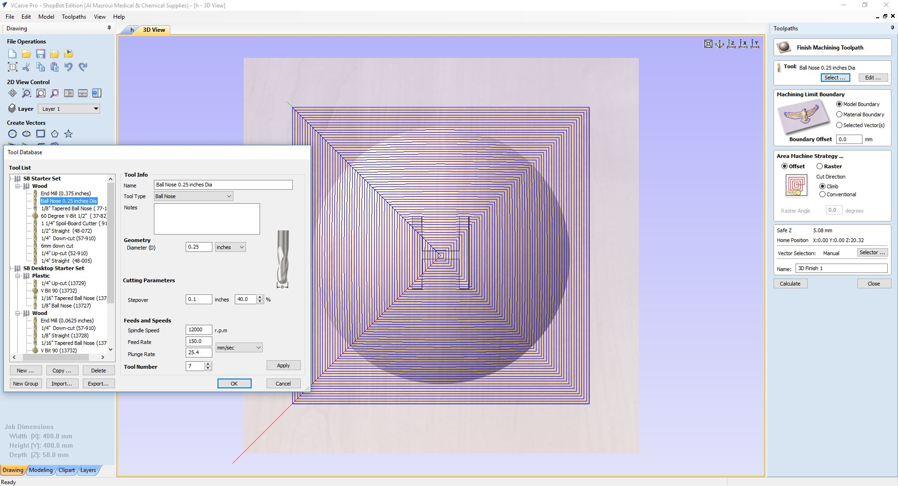   
  
Finishing Toolpath Settings

The below video shows parts of the finishing operation:

<iframe width="560" height="315" src="https://www.youtube.com/embed/85CiLbnghmk" frameborder="0" allowfullscreen></iframe>
  

Then I used sanding paper to finish it as shown in the below image:

  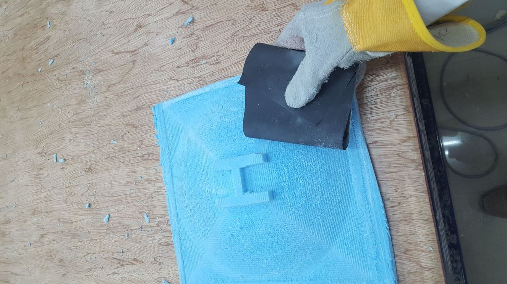   

The final mold is shown below:

  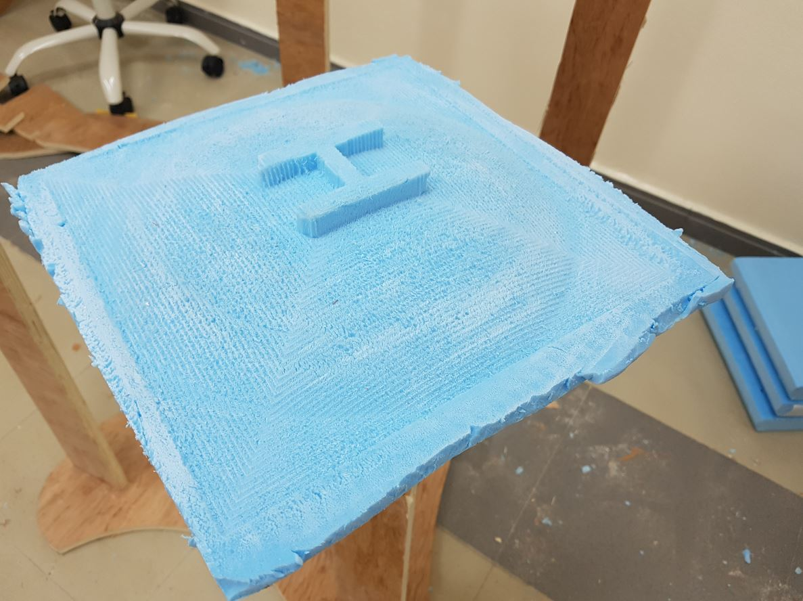   

### ***Making the Composite***

We sourced the resin locally, the product name is D.E.R. 331 Liquid Epoxy Resin. I attached the [datasheet](datasheet.pdf) to my archive. According to the datasheet, it is a liquid epoxy resin that is a liquid reaction product of [epichlorohydrin](https://en.wikipedia.org/wiki/Epichlorohydrin) and [bisphenol A](https://en.wikipedia.org/wiki/Bisphenol_A).

The hardener was [Aradur 42](hardner.pdf) and it came with a containers of 1 KG while the epoxy resin came with a container of 5 KG so we thought that the mix ration is 1 to 5. The material safety datasheet can be found [here](safety.pdf). I wore a lab coat, thick plastic gloves and face mask during making the composite.

I cut two soft sackcloth in a way that their fabric grain is in opposite directions to increase the strength of the composite and two hard sackcloth as shown below:

  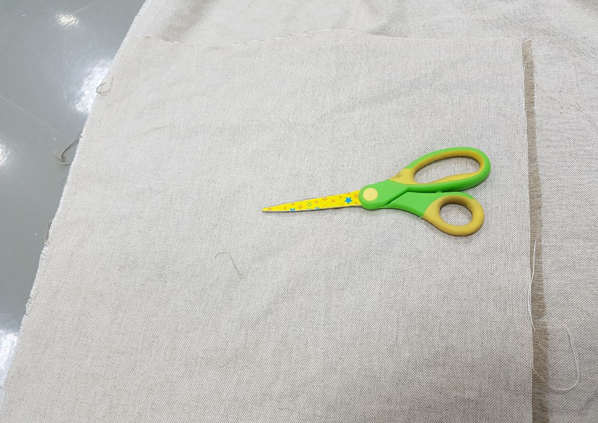   

I used scissor to cut and I should have flatten the 3D object first then laser cut the 2D design. However, I did not have time to do this and my design was simple.

Then I prepare the setup as seen below:

  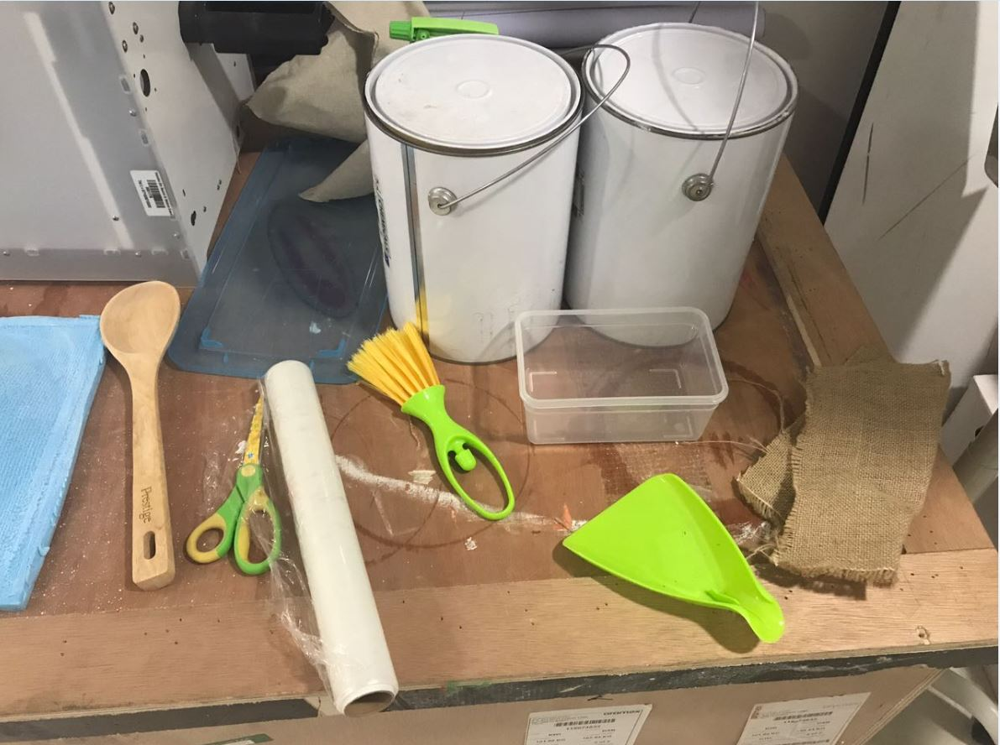   

After that mixed the epoxy resin with the hardener using a small container as shown below:

  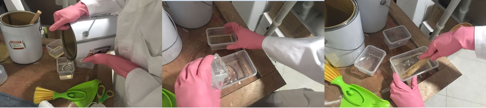   

Then I continued to mix them for more than 10 min until the mix became a bit hard and all the hardener mixed well with the epoxy. After that I applied the plastic film on the mold so it will not stick with the composite. Then I put the first layer of the sackcloth in the mixture and rinse with it then carefully twisted on top of the mixture so the residuals will fall in the container.

  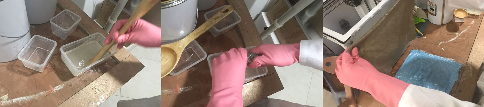   

Finally, I placed the first layer at the mold followed by the second and third layers which were made of the hard sackcloth and I put them in a way so their fabric grain is in opposite direction. Then I applied another layer of plastic film to prevent the vacuum bag from sticking to the composite.

  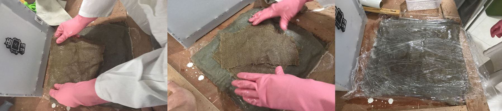   

After finishing making the composite, I put it in a vacuum bag and used the vacuum cleaner to pull out all the air so all the parts of the composites are stick to each other and to the mold.

  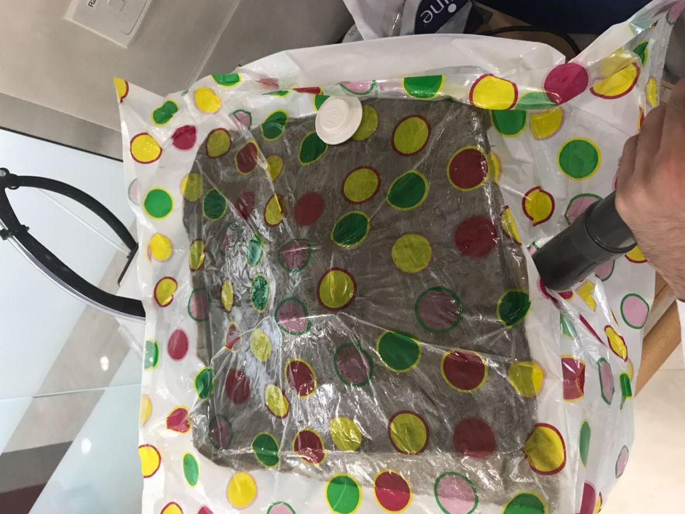   

Then I let dry for 2 days and the end results can be shown below:

     

  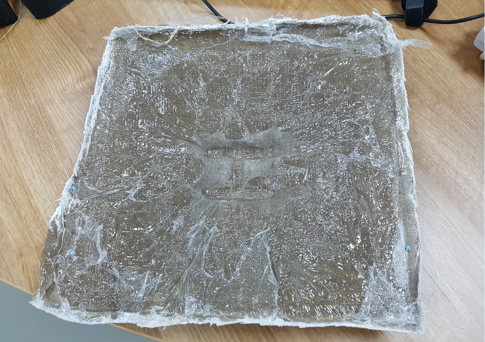   

### ***The Conclusion***

I learned how to make composites and I did make one, well not the best one out there but I learned the workflow so I think I will try better composites after fabacademy to improve this skill. In the end I want to thank Francisco, [Muadh](http://archive.fabacademy.org/archives/2017/fablabuae/students/163/) for helping me in making the mold and the composite.

I want also to note that I got the material safety datasheet from [Ahmed Najeeb](http://archive.fabacademy.org/archives/2017/fablabuae/students/256/w14.html) Archive.

### ***Files of the Week***
- [Fusion360 Mold Design](mold.f3d)
- [VCarv Mold File](mold.crv)
