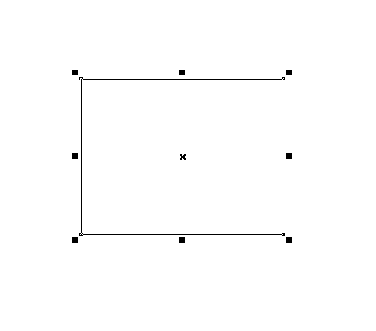
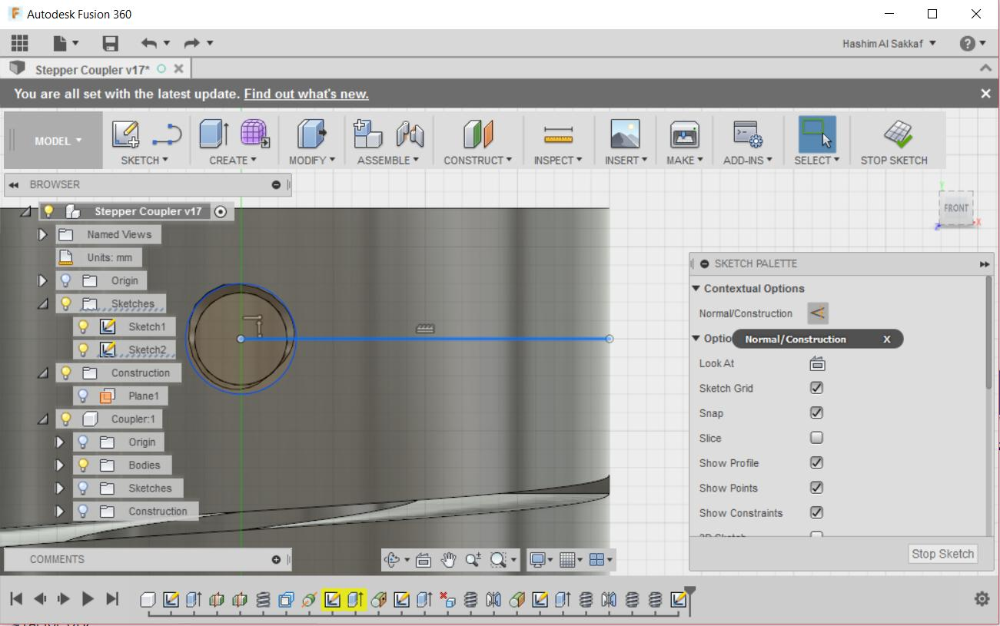
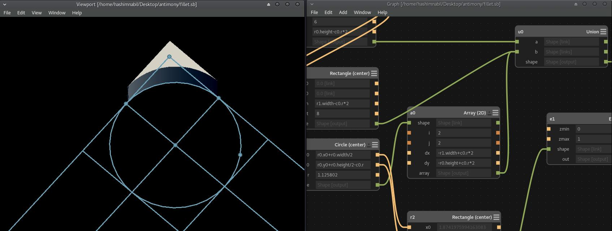

## ***Week 2: Computer-Aided Design***

## ***Raster***

Raster graphics or images is a dot matrix data structure representing a generally rectangular grid of pixels or points of  color according to [wikipedia](https://en.wikipedia.org/wiki/Raster_graphics). To put simply its an image or graphic that gets "pixelated" when you zoom in, in other words, it does not support lossless zoom. I have been using raster files all the time just like any other human that is exposed to a computer! Any screenshot I take for my laptop screen or phone screen, any picture I take with my smartphone and most of the pictures I download from the internet, all of these are raster files. As this week assignment require from us to use and test some raster files editing software, I will list on this section my experiment with some of the tools and software that I used to edit raster files even though I used some of them before this week.

### ***CamScanner***

I have been using [CamScanner](https://www.camscanner.com/) since I was studying at university, as it saves me a lot of time. Its a smartphone application that can turn camera pictures to scanned documents and you can share the results in PDF or JPG format. What make this program very handy is the end result as your scanned document will look as if it was scanned with real scanner specially if your phone camera is good. I used CamScanner to scan my hand drawings of my [final project](finalproject.html).

### ***Deepin Screenshot***

[Deepin-screenshot](https://www.deepin.org/en/original/deepin-screenshot/) is a simple smart screenshot tool of deepin linux, yet its very powerful and quite handy. I installed in my manjaro linux and started using it in taking all of my fabacademy archive screenshots as its very similar to snipping tool of windows 10 which I used to use before I immigrate to manjaro linux. Deeping-screenshot has smart window feature that can automatically detect the window that you are opening as well as the ability to draw any window that you want to take as screenshot using the mouse.

The only drawback I found while using this tool is that it only outputs png format images which I found to have large size thus I used graphicsmagick to convert all my screenshots to jpeg which proved to have less size than png.

### ***GraphicsMagickagic***

[GraphicsMagick](http://www.graphicsmagick.org/) is an image processing tool that can work with almost all image formats! I started to use it quite extensively since the beginning of fabacademy. I mainly use it to convert from one image format to another, as I used it to convert all my screenshots which were in png format, to jpeg format as I noticed that this reduce the size of the image significantly.

To convert from one format to another I use the following command:

```
gm convert inputimage.png outputimage.jpeg
```
It is so simple tool that can do many things as well such as resizing images which can be done using the following command
```
gm convert  inputimage.png    -resize 64x64\!  inputimage.png

```
I learned these from this [imagemagice tutorial] which means that imagemagick and graphicsmagick share the same syntax!, `\!` in the above command is used to ignore the aspect ratio while converting.


In addition to that, I also used graphicsmagick to create a collage of images vertically and horizontally which can very handy for documenting process as advised by Mr Fransisco Sanchez.
```
gm convert image.png image2.png -geometry 600x400\! -append outputimage.png
gm convert image.png image2.png -geometry 600x400\! +append outputimage.png
```
`+append` will results in merging the images next to each other horzintally from left to write as shown below:

<p align="center">


</p>

while `-append` will results in merging the images vertically from top to bottom as shown below:

<center></center>
### ***Gimp***

Gimp is the open source alternative of Adobe Photoshop as it can do very advanced image editing. My experience with gimp was very little as I used it to cover my ssh key while documenting the process of linking the ssh key with fabacademy archive in [week 1](week1.html) assignment, as I marked my ssh key with black boxes. I also experienced the blur effect.

## ***Vector***

### ***Inkscape vs Coreldraw***

I always wanted to make my inkscape my main software for design for laser cuting as its open source and free. However, when I started using it I found it not user friendly and is missing some important details that I like to use when using coreldraw such as the 9 snaping poit of each shape. This feature is one of the most important featurs in Coreldraw as with theses points you can snap new shapes to differentt points of the existing shapes such as the center, all the cornerts and the centers between each two corners as shown below:

<p align="center">



</p>

This feature is really handful for laser design and vector design in general as it helps in aliging shapes very easily.

On the other hand, I did not find this feature in Inkscape as it has four shape identifying points as shown below:

<p align="center">


</p>

This was a major issue for me so this killed my desire to switch to Inkscape. I know there are some allignment tools but using them is much slower compared to coreldraw and is not user friendly. So I ended up using coreldraw for vector design during fabacademy as for example in [Week3](http://archive.fabacademy.org/archives/2017/fablabuae/students/154/week3/week3.html).

## ***CAD***

### ***Fusion360***

I used fusion360 before fabacademy and I still find it to be the best CAD software as it has everything in one program actually in one window, It is based on cloud storage so all my files are linked with my email and I can download all my files from anywhere. The only drawback is that you can't open a local file that is stored at your desktop, as you need to upload it first.

I designed a stepper motor coupler adapter for two of the stepper motors of anymaker machine that we made at FabLab UAE which is an 3 axis CNC machine with changable head. We broke two stepper motors couplers so I designed a 3D printed coupler using fusion360 as shown below:

<p align="center">

<center>Consturction lines</center>
</p>

<p align="center">

<center>Consturction planes</center>
</p>

<p align="center">

<center>Parametric design</center>
</p>

I also used fusion360 as CAM software as in my molding and casting assignment. Fusion360 proved to be a very handy software due to its simplicity and wide range of features.

### Antimony

This is my first time to try such software, I mean its not like any software that I saw before, I heard about snapCAD and I saw few tutorials about it in the past, it is based on coding the shapes instead of drawing them, but Antimony is super easy to use yet super fast and super powerful, It is based on graphical flow chart programing that can be done using nothing but the mouse, and you can access the source code of the grapgical block and even edit it using the python code of the ready-made function.

I tried the [tutorial](www.mattkeeter.com/projects/antimony/3/) of Matt Kateer, the guy who wrote this software, and did a screw driver, then I experiment it even further by doing a rounded edge rectangle using mathmatical relations between 2D rectangles and circule, then extruding it to be as shown below:

<p align="center">


</p>

It was a reply to one of the students in the FabLab mailing list, but I noticed that this rounded rectangle is already there in antimony, so edited even further to end up with the fillet cut-out that can be used to make the fillet effect by subtracting it from the shape with the sharp edge.

<p align="center">



</p>

## Video Editing

I tried Kdenlive to make a video for anymaker machine as shown below:

<center><iframe width="560" height="315" src="https://www.youtube.com/embed/TOkX7mwmp-o" frameborder="0" allowfullscreen></iframe></center>

I learned the software from this amazing [youtube series](https://www.youtube.com/watch?v=TmDzgXmjqEc). I found it to be a very easy and fast video editing software untill I tried iMovie for my final project and I was amazed with its speed and ease of use!


### Design files

1- Antimony [Rounded Edge Rectangle](round edged rectangle.sb)

2- Antimony [fillet cutout](fillet.sb)

3- anymaker video kdenlive [file](anymaker.kdenlive)

4- Fusion360 stepper [couopler](stepper.f3d)
