## ***Week 3: Computer-Controlled Cutting***

### ***Vinyl Cutting***

I designed the first version of my final project logo using CoreldDraw software as I am very familiar with it and I don't have time this week to learn inkscape as I wanted to spend more time with other software such as antimony. So my logo is based on [Harlow Solid Italic](http://www.fontpalace.com/font-download/Harlow+Solid+Italic+Italic/) and I replaced one of the "x" sticks to look like one axes of my anyAxes project as shown below:

However, this is the first draft and I will most likely change it on the future. I used the offline FabModules in Fransisco's laptop as he can drive the machine directly from FabModules. I exported the design as PNG image with 500 dpi resolution so fabmodules can trace it well. The picture below shows the logo processed in FabModules:

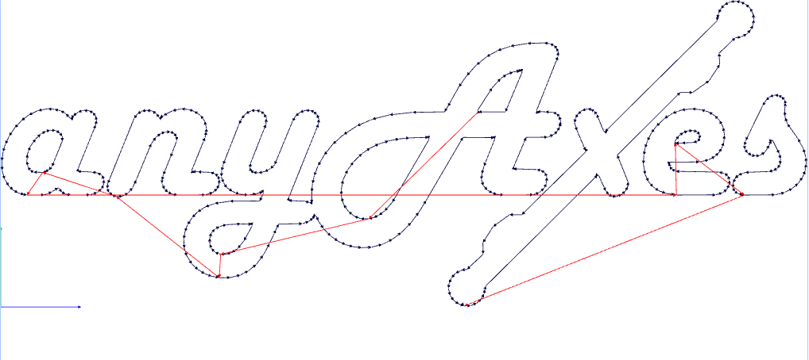

We are having Roland GS-24 CAMM-1 vinyl cutter. It is very fast and very accurate vinyl cutter. It can work with rolls or even pieces of vinyl. So the first thing I did before cutting the design was adjusting the machine to cut from piece instead of cutting from roll. Then after cutting the design, the hard part begins! which is removing the un-needed parts from the design and of course sticking it! First I cut the piece that contain the design and removed the un-needed vinyl with my hand. as shown below:

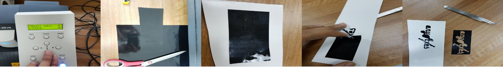

Then I used the cutting knife to remove the inside pieces of the vinyl. After that I used the application tape to take off the design and place it in my notebook as shown below:

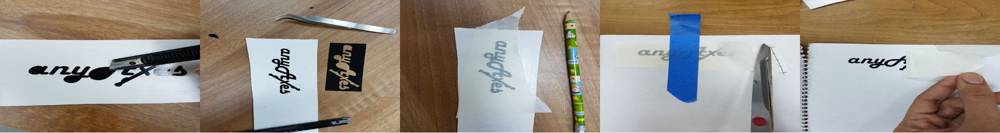

The final logo after sticking it to the notebook is shown below:

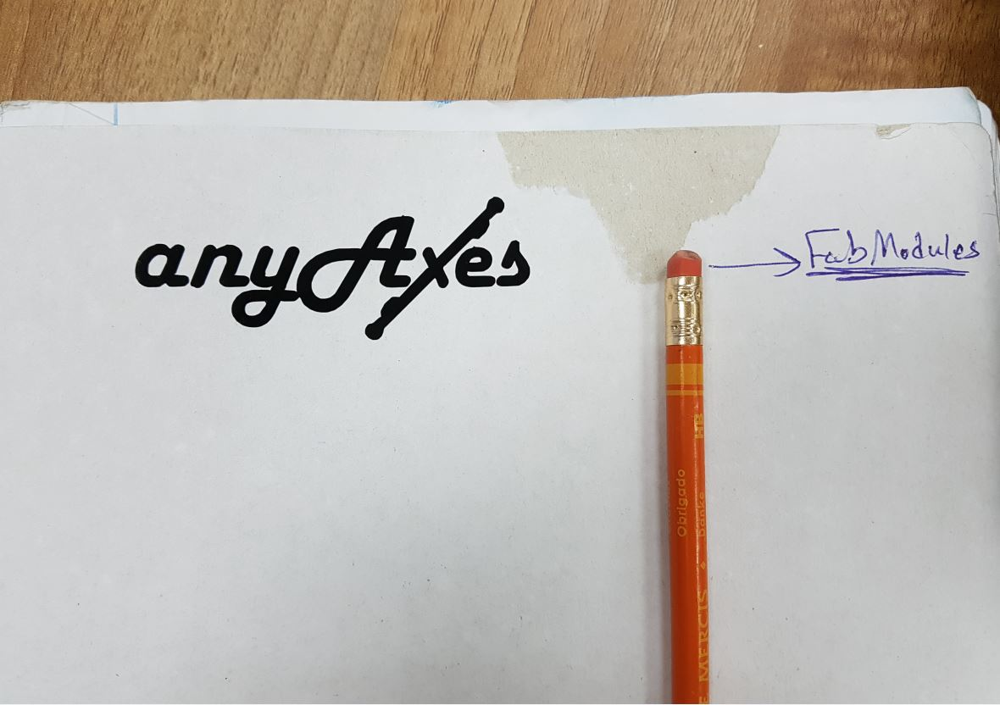

### ***Laser Cutting***

We had to design a laser cut press fit kit. For this task, I used antimony which is a parametric software unlike any other software I used before. I installed it by following the instruction in its [Github](ttps://github.com/mkeeter/antimony/blob/develop/BUILDING.md) page.

The design is driven by mathmatical relationships between primitive shapes or what called "Constructive Solide Geometry". It is hard at the begining because I did not try such software before but I really liked the end result, as it is easy to edit the design. All I have to do is to change one parameter that is of course has a direct and indirect realationship to all the parameters of the design.

So I made a kit that consists of two pieces, the main piece which is a square with 4 slots as shown below:

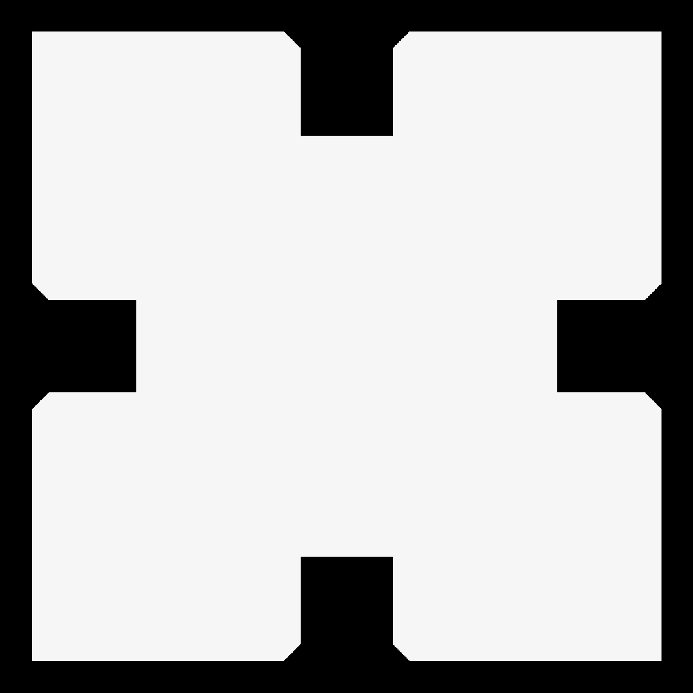

I started by a rectangle then I made the slots using a union of 2 triangles and a rectangle then I made a polar array of this some and finally I cut this sum from the main rectangle, it is a pure math!!!

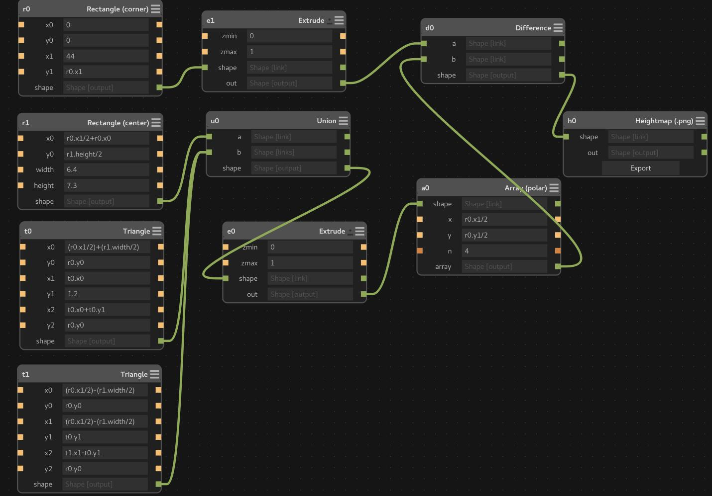

After clicking the export button, I made the resoultion to be 25 pixels/mm which is 635 pixel per inch (ppi) which is more than enough for fabmodules to process, however I did not need that as I used coreldraw.

The second piece is a circular piece that can extends the posibilities of the design of the kit, as it helps in moving by 45 degrees in 4 extra directions.

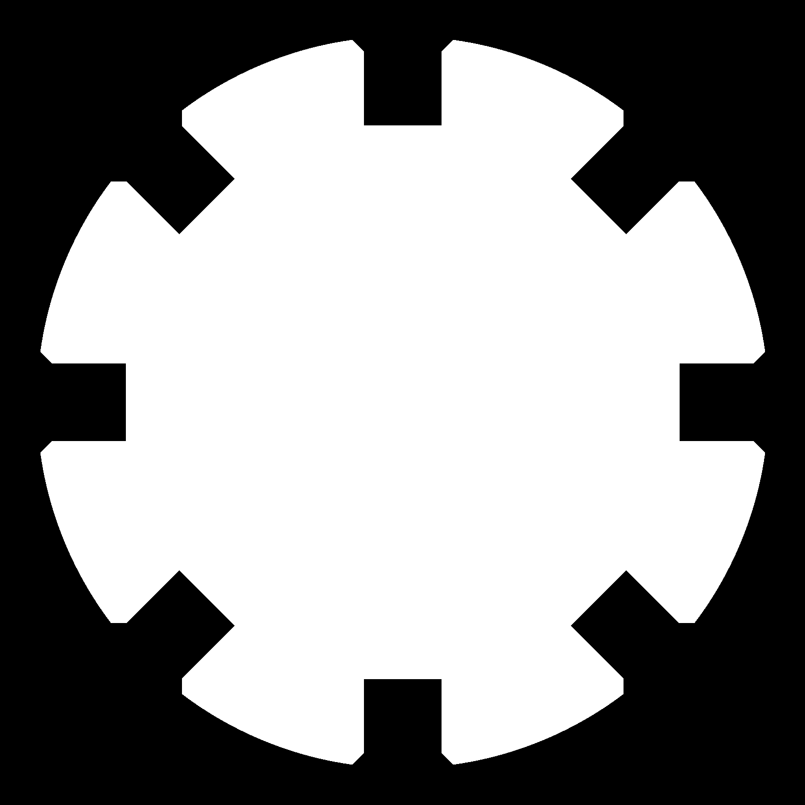

I used to make laser cut boxes and iterlock acrylic pieces together using holes and rectangular slots. But this time I used different method, which is to make 45 degree cuts at the end of each slot towards the end of the material. I learned this from the lecture as this helps in making the fiting operation easier spceially for tight fit cases.

After designing the kit, I exported the design as png images then I used coreldraw to trace the image and cut the parts.

I have used the main laser cutter we have whihc is [Universal VLS 6.6](https://www.ulsinc.com/products/platforms/vls660), it is CO2 laser and we have the 40 W laser tube version. It is a very good machine as it is very easy to operate and very sturdy as well. Even though it is only 40W it can cut acrylic up to 12 mm! To cut the parts, I changed the `stroke` color to *Red* and the stroke thickness to `hairline` as this color and this thickness is represent the vector cut  settings in UCP software which is the CAM software of the machine. Then I clicked on 'ctrl+p' which is the print command, then `Prefrences` where I used the below settings:

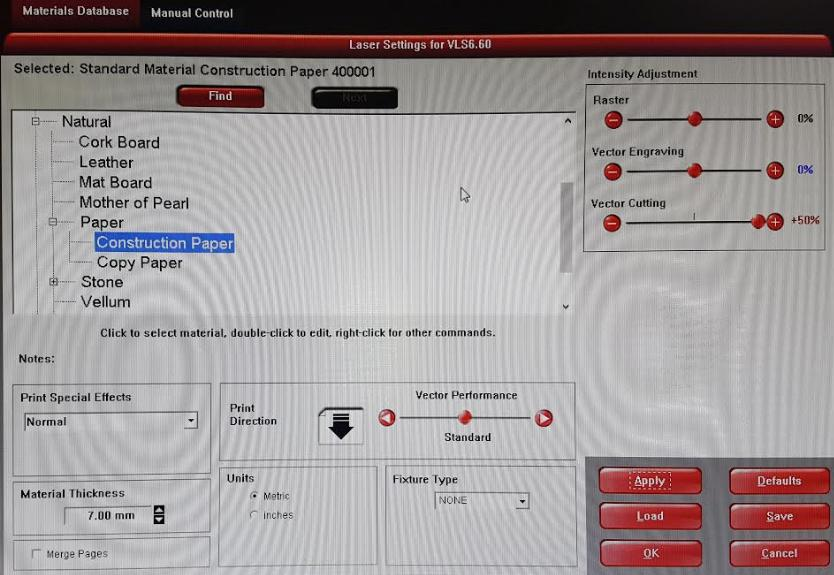

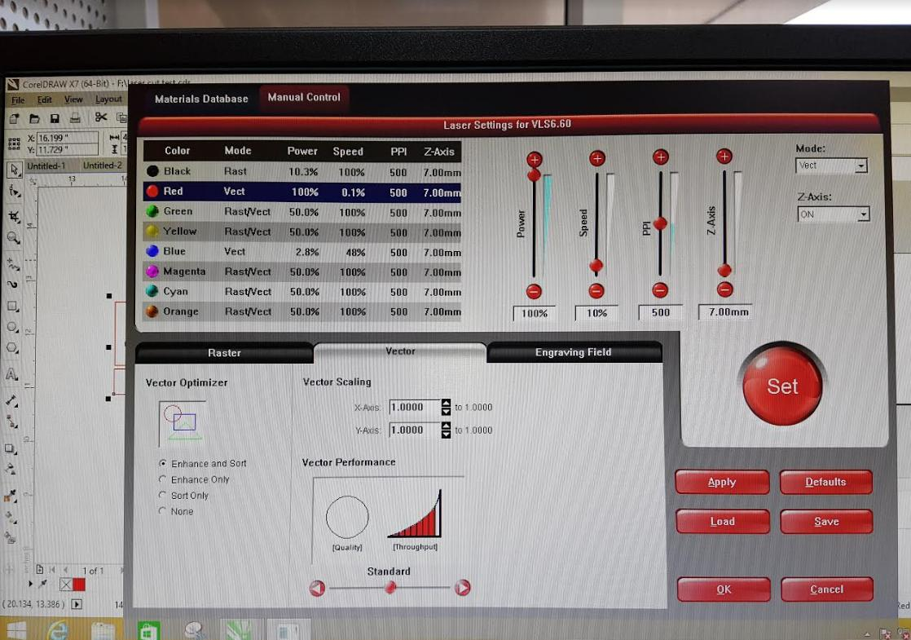

 The parts came out nicely as the below image shows the two parts of the kit:

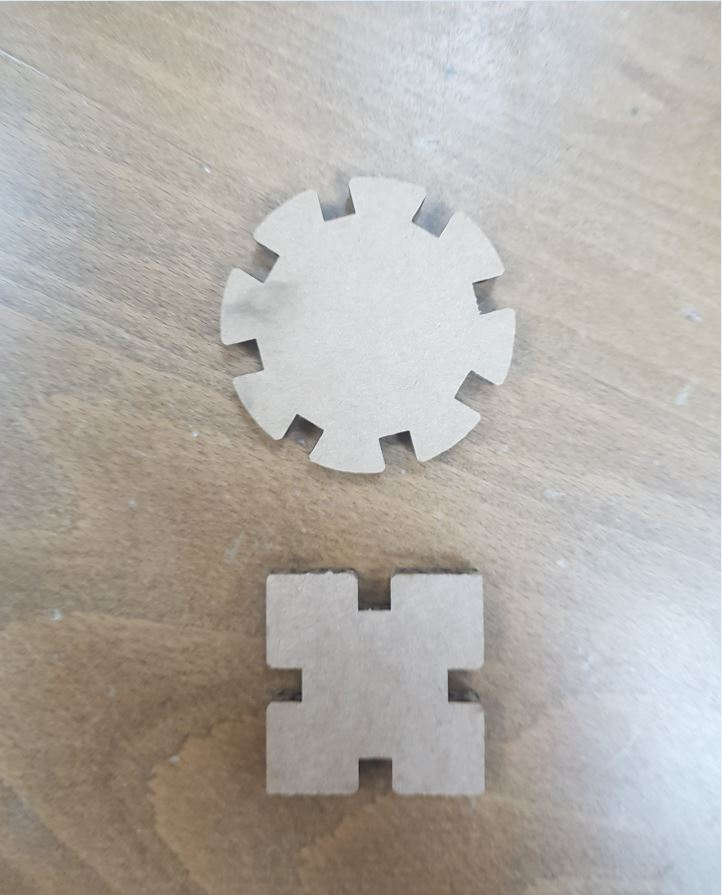

Then I made a simple construction using the kit as shown below:

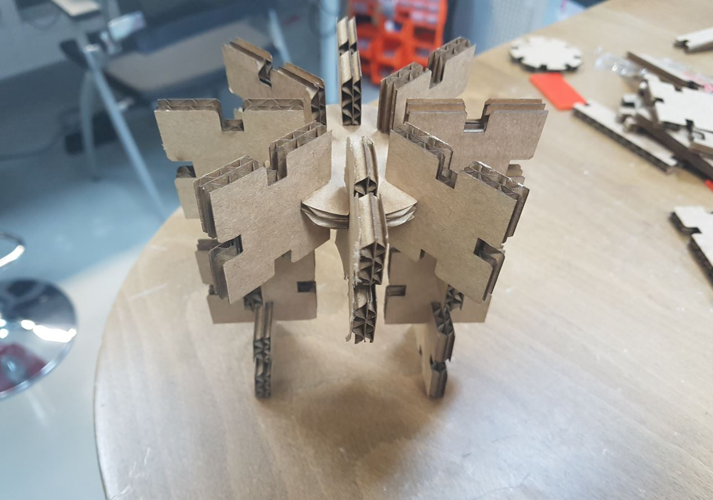

I noticed that the 45 degrees cuts at the end of the slot was really helpful in aligning the pieces and smoothing the fiting process.

### ***Files of the Week***

- [anyaxes logo cdr](anyaxes.cdr)
- [anyaxes logo dxf](anyaxes.dxf)
- [square.sb](square.sb)
- [circle.sb](circle.sb)
