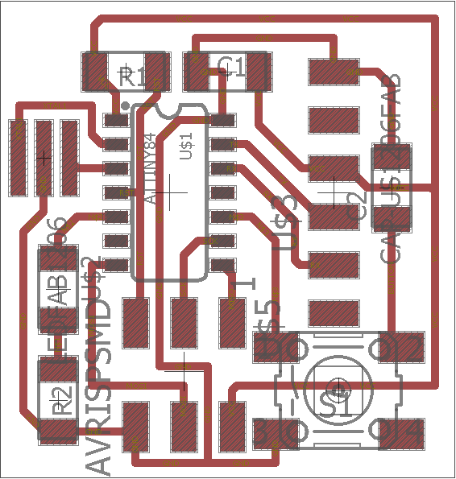

## ***Week 15: Networking and Communications***
### ***The Serial Communication: First Try***

I did not do last week assignment due to some difficulties that I had and due to the fact that I am catching up with all the weeks. So I started with using [Neil's Serial Bus C program](http://academy.cba.mit.edu/classes/networking_communications/index.html). I used my [week 6](http://archive.fabacademy.org/archives/2017/fablabuae/students/154/week6/week6.html) board as the first board for this week.

<p align="center">
     
  <center>My Week 6 board</center>
</p>

As this board is actually a modification of the edco-hello-world board, it has serial pins in the same orientation of a normal FTDI connector. This was ideal for me as I did not design any board for serial Communication or we can say I did not have time for that. So I edited Neil serial bus C code as you can check it [here](nod1.c).

As you can see I filled the code with comments, as it was very hard to understand for me from the first time. I am thinking of so many things at the same time as I am passing with bad circumstances right now so I could not focus at all. So to make things easier I explained the main functions of the code as shown below:  
`get_char(&serial_pins, serial_pin_in, &chr);` this function wait for serial message of one character. So I made a condition that if the board received 'z' character, the LED will turn the on and if it received 'x' it will turn off the LED. I hoped that everything will work as expected and life will be good but no it was not! The LED was blinking for more than one second! to be exact it was 8 second. Mr Fransisco helped me figure out this issue. So he asked me to check the make fuses in the make file. Well I did not know anything about fuses as I did not face this issue till now, luckily! So he directed me to this nice [tutorial](http://docs.academany.org/FabAcademy-Tutorials/_book/en/week8_embedded_programming/attiny44_fuses.html) for the fuses.

My board was using external 8 MHz resonator and the make file and it happened that I burn the fuses to be a value that is not obviously 8 MHz...Well I was using the button to turn the LED and I did not have any delay in week 8 program and further debugging, it turned out that I already burned the fuses with the make file of [edco-hello-world](http://academy.cba.mit.edu/classes/embedded_programming/hello.ftdi.44.echo.interrupt.c.make) of week 8.

The burn fuses command was ```avrdude -p t44 -P usb -c avrisp2 -U lfuse:w:0x5E:m``` and this was to set the clock to be 20 MHz, so after following the fuses tutorial I changed it to be ```avrdude -p t44 -P usb -c usbtiny -U lfuse:w:0xEC:m ``` which will make the clock to be 8 MHz. What I understood from the fuses of attiny44 tutorial is that we can set the fuses through the ***Low*** ```lfuse```, ***High*** ```hfuse``` and ***Extended*** ```efuse``` values.

Now the board worked as expected as shown in the below vides:

<p align="center">
<iframe width="560" height="315" src="https://www.youtube.com/embed/eLRwfKkrNpM" frameborder="0" allowfullscreen></iframe>
</p>

After checking that the board is getting the serial data from the PC using the FTDI connector. I connected it to my [week 10 board](http://archive.fabacademy.org/archives/2017/fablabuae/students/154/week10/week10.html) that has LED connected to PA1 & PA3 which are same pins assigned for the `IN1` & `IN2` of A4593 H-Bridge. The goal was to have different LED color for each direction of spinning of the DC motor.

I programmed the board to blink the two LEDs in a reverse sequence when the button of the first board is pressed. This is happending as the following:

- When the button of board A (week 6 board) is pressed. The board will transmit a character `x`.
- The second board will keep checking for character `x` and if it receives a character `x` the two LEDs will blink. It is a very simple serial communication protocol to try the serial communication in AVR boards with C language as I was used to do serial communications using Arduino programming. The below image shows the setup I used where the first board TX, VCC and GND are connected to the second board RX, VCC and GND respectively.

<p align="center">
   
</p>

The below video shows that the 2 LEDs in board 2 are blinking when the button in board 1 is pressed.

<center><iframe width="560" height="315" src="https://www.youtube.com/embed/biuOzAR1ZPs" frameborder="0" allowfullscreen></iframe></center>


### ***Files of the Week***

- [serialButton.c](serialButton.c)
- [serialRead.c](serialRead.c)
- [makefile](makefile)
