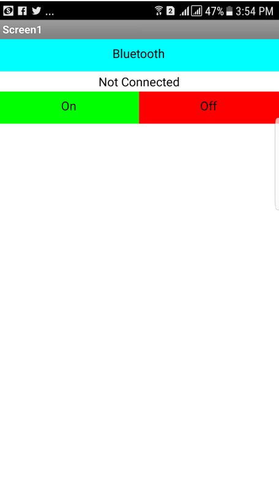

## ***Week 16: Interface and Application Programming***

## ***The Assignment***
This week assignment require us to make application that interfaces at least one input or output. I made a simple android app using [MIT APP Inventor 2](http://ai2.appinventor.mit.edu/) that sends letter 'a' if button 1 is pressed and letter 'b' if button 2 is pressed. The app communicates to my [week 6]() board via the [HC-06](https://www.olimex.com/Products/Components/RF/BLUETOOTH-SERIAL-HC-06/resources/hc06.pdf) bluetooth to serial module.

### ***Hello Bluetooth!***

At the begining I made a simple application to get used with app after learning from this nice [tutorial](http://www.instructables.com/id/Course-on-MIT-App-Inventor-and-Arduino/) by Magesh Jayakumar. So I made a simple anrdiod app that has 3 buttons which are:

- **Bluetooth**: connect the bluetooth to the bluetooth to serial module that is connected to the board that has the LED.

- **On**: when clicked sends character `a` to turn on the LED.

- **OFF**: when clicked sends character `b` to turn on the LED.

     

     

First I tested the app on my [week 6](http://archive.fabacademy.org/archives/2017/fablabuae/students/154/week6/week6.html) board that has serial interface. I connected the HC-06 bluetooth module to the board using female wires as shown below:

     

Then I edited [Neil's serial bus code](http://academy.cba.mit.edu/classes/networking_communications/bus/hello.bus.45.c) and made it switch on the LED if letter 'a' is received and switch it off if letter 'b' is received. The below video shows the system working:

<iframe width="560" height="315" src="https://www.youtube.com/embed/S7oI9ZNj0Wo" frameborder="0" allowfullscreen></iframe>

With this I am ready to work on the final project mobile app!

### ***FabRover APP***

My final project **FabRover** has 7 different electronic boards or lets call them nodes. I put all the electronic design files of the nodes and brief explaination of each one at my [final project](http://archive.fabacademy.org/archives/2017/fablabuae/students/154/final_project/finalproject.html) page. In general, the anrdoid app should control the movement of the FabRover wheels as well as gets the readings from the LDR board. I have 6 wheels to control but I will start with controling one wheel and getting the readings from the LDR. So I need to desing an app that do the following:

- Control the servo position.
- Control the DC motor speed and direction.
- Get the readings from the LDR and display it.

After that, I tested the same code with my [final project](http://archive.fabacademy.org/archives/2017/fablabuae/students/154/final_project/finalproject.html) node board that has an servo and DC motor to verify that the serial communication system is working properly. So I edited the Andriod App to have 6 buttons to control the servo and the DC motor as the following:

- Button 1 -> Stop DC motor.
- Button 2 -> Move wheel in clockwise direction
- Button 3 -> Move Wheel in anti-clockwise direction.
- Button 4 -> Move servo to 0 Degree
- Button 5 -> Move Servo to 90 Degree
- Button 6 -> Move servo to 180 Degree.
2
The below image shows a screenshot of the new application:

     

I also attached this short video that shows the wheel being controlled via the mobile app:

[Bluetooth Wheel Control](video2.mp4)

With this I am almost done with the programming of my final project as I am only left with connecting the input device which is in my case the Light Depending Resistor (LDR) to this system and replicating it 5 more times!

### ***Files of the Week***

- [Bluetooth_LED.APK](Bluetooth_LED.apk)
- [FabRover App MIT APP Inventor 2 files](FabRoverx.aia)
- [Rover.APK](fabrover.apk)
- [Bluetooth_LED LED](LED_blue.c)
- [Main Board C Code](main.c)
- [Node C Code](node.c)
- [Make file for 20 MHz boards](makefile)
