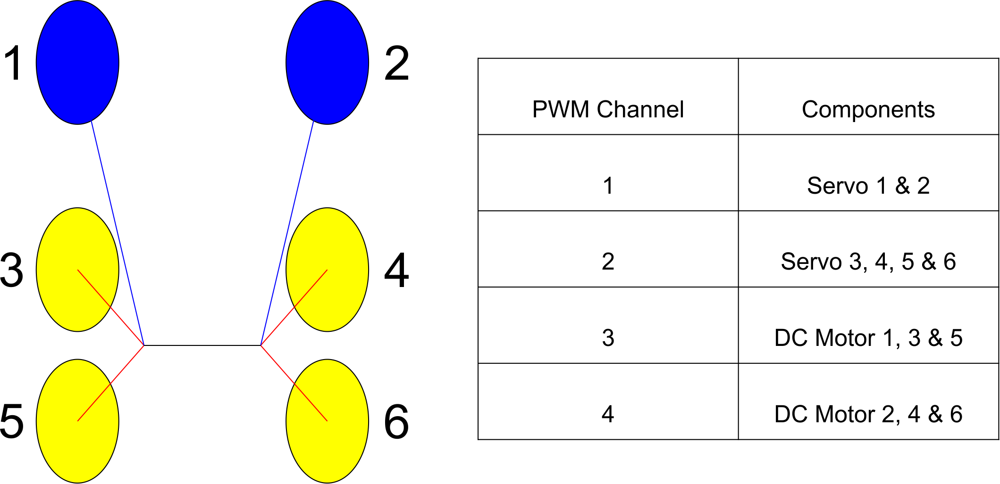
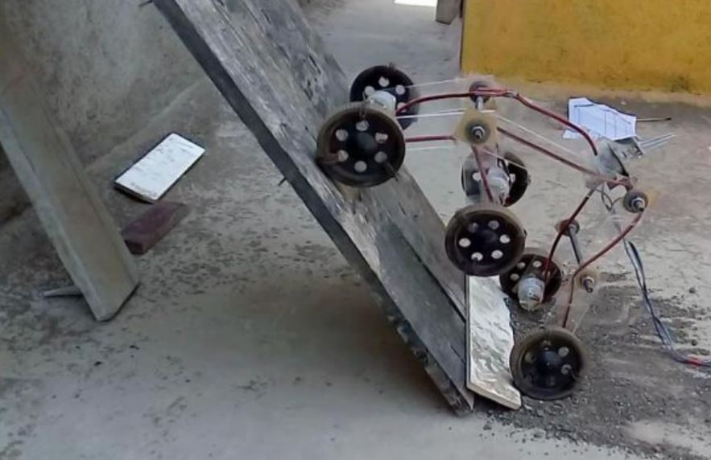

## ***Week 17: Applications and Implications***

This week assignment require us to propose a final project that integrates different skills that we learned through Fabacademy and answering some questions regarding the project.

### ***What it will do?***

Just yesterday, 30th of May, I picked a final project that I want to make as I was hesitating a lot due to the limited time I have and the lot of work that I need to finish. I want to make a fabable open rover platform that is based on rocker bogie suspension system. The idea is to create an autonomous desert rover for measuring temperature, moister, wind speed and dust level in the desert and send data periodically. However, for Fabacademy final project, I will limit it to making the rover move wirelessly with one input only such as temperature sensor due to the time limit.

So the rover will have 6 wheels where each wheel has a separate DC motor for forward and backward driving and a servo for turning. The below figure shows the distribution of the motors and the needed PWM channels for the whole rover:

   

With this control scheme the rover should able to move in almost all directions and it will have different control schemes as well. The rover will be controlled from a smartphone via Bluetooth and the temperature measurements will be sent to the phone app periodically.

### ***Who's done what beforehand?***

I saw many rocker bogie rovers projects while I was searching about it, but I will list the ones that I found most useful.

1- 2D Rocker bogie without differential. A great example will be [this rover](https://www.researchgate.net/publication/313403109_Design_of_Rocker_Bogie_Mechanism) that is done by Sameer Sheshrao Gajghate, where he clearly explained the process of designing the rover. This rover can be laser cut or CNC milled, but it lacks the differential link which helps in making the main body of the rover balanced.

   

2- [Rocker Bogie Rover](https://seelio.com/w/2f4j/rocker-bogie-mechanism) with differential, which is done by Mohammed Rehman, I liked their design and the use of differential in the rover, so I will adapt the differential as well but with horizontal orientation of the main bevel gear.

### ***What materials and components will be required?***

The main frame will be made of acrylic and we have 12 mm acrylic so I will use that with our Universal VLS 6.6 Laser Cutter that can cut it with good quality even though it is only 40 W!

The wheels will be made by PLA using the 3D printers as we have more than 4 working 3D Printers right now so I will let all of them work at the same time.

I will also need FR1 boards for the electronic boards of the project. And of course I will need a lot of M4 screws that I can source locally. In addition, I need bearings and 12 mm thread and I can source that locally as well.

As my project consists of 6 wheels, I will need 6 dc motors and 6 servo motors. The DC motors we bought from Jamaco before Fabacademy for the general use in the lab so I will have to buy the servos and I can find them locally.

### ***Where will they come from?***

- acrylic, servos, screws, bearings = Local supplier
- Dc motors, 3D printers filament = our Fablab provide them for free!

### ***How much will it cost?***

- acrylic: around 200 AED which is around 50$. However I will not use all of it so the cost will be less.
- 6 tower pro gm996r servos with 40 AED each so 6 will be 240 AED which is 65.34 $.
- 5 12 mm inner diameters bearings with cost of 9 AED per piece so 45 AED total which is 12.25 $.
- set of 25 mm M4 screws and nuts which is around 25 AED which is around 6.81 $.

### ***What parts and systems will be made?***

I will make almost most of the project such as:

- Main Frame which consists of the rocker and bogie joints.
- The 6 wheels
- The differential mechanism.
- The DC motors and servos mounts.
- All the electronic boards.

### ***What processes will be used?***

- 3D Printing
    - wheels
- Laser cutting
    - Frame and motors mounts
- electronic production
    - all electronic boards
- Vinyl cutting
    - Vinyl sticker of the frame

### ***What tasks need to be completed?***

- 3D Printing the wheels.
- Vinyl cutting
- programming

### ***What questions need to be answered?***

How to use I2C with attiny in C not in Arduino. The rest is a matter of time for now.

### ***What is the schedule?***

There are many task that I need to finish which are:

- 3D Printing the wheels
  I assigned one week for that as each wheel takes almost 2 days to finish but the printers kept failing 5 times which delayed the process more than one and half week than sheduled.

- Desiging the PCBs of the FabRover which are the main board and the 6 nodes.
  I assigned one day for designing and stuffing the boards but I realized that this was not enough, I needed two days and with the help of my Fablab UAE workmate Waleed, I managed to finish this task but 4 nodes out of 6 where completed as we were short of the 1A regulators.
- Frame Design.
  I assigned one week for this task but I took more than that to finish, all because I did not apply iterative design skills properly. Thus this task delayed me a lot.  

  At the end, I found that I should have worked in parallel in all task and I should have applied iterative design skills as I should have cut the frame from the first day I started the design then I will find the mistakes so I can fix them.

### ***How will it be evaluated?***

I will be happy if the differential system and the rest of the mechanical design work just fine and regarding programming I want to control at least one wheel using the mobile app that I am designing.
