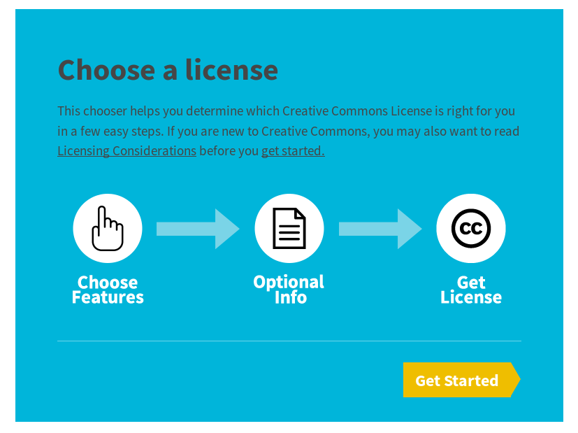
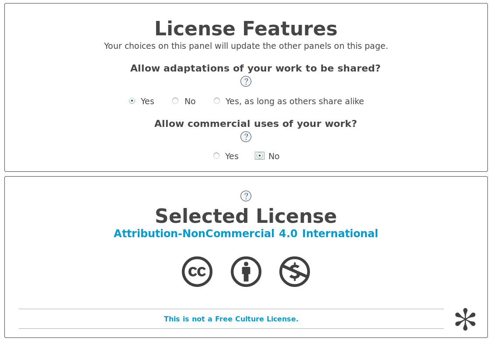

## ***Week 18: Invention, Intellectual Property, and Income***

***The Assignment***
--------------------

To market our final project!
***Name***

I selected the "Fab-ROVER" name for my project. However I might change it.

## ***Licensing***

#### ***Open Source***

For licensing I prefer to make my project open source because I learned from the internet and making it open source will gather a community around it which will make it better as I believe that open source products will be the trend in the future. In addition, I like to help others as I struggled to learn what I needed to make this project and I learned from open source content such as youtube vides, open source books and articles so it is like giving back to the community!

#### ***Morals and Rules***

The idea of licensing is protecting authors rights. Regulating it, will help in protecting rights and organizing licensing internationally or in the large scale. I believe that is a must nowadays but I also believe in Morals. I mean everyone should have self constrains, or morals that prevent him from stealing other ideas, free ridings or lying. In Islam, we believe that God is watching so it is like self control for us. However, humans are not perfect so I faced many issues during university and even work. Some people are just like that and will not change no matter what. This is because of lack of morals as I think before enforcing regulations regarding copyright issues, we need to enforce morals into the coming generation to teach how bad is lying and free riding can be.

#### ***Choosing the license***

I used to use Creative Commons Attribution-NonCommercial-ShareAlike 4.0 International License, so I will share my project with this license as with this I can get benefit from commercial use of the project as well.

To choose the license I did the following steps:

   

   

## ***Dissemination Plan***

For now, I don't have a clear idea about marketing my project but there are a lot of possibilities, specially here in UAE. UAE aims to reach Mars by 2020, so I can sell my knowledge and experience in fabricating the Rover with Mohamad Bin Rashid Space Center as a form of workshops or consultations. In addition, I can sell the kit for universities for steam activities for first year students as STEAM market is prospering in UAE. However, I need to create a second version of the project that is more rigid by fixing the issues I hade with the project.

A second option will be making a [kickstarter](https://www.kickstarter.com/) champain but I need to decrease the complexity of the project and decrease the manafacturing cost. This can happend by replacing the main frame of the project which is made of acrylic with hard tubes that are made of hard ABS plastic or aluminum, this will also increase the strength of the frame.

### ***[Slide](http://archive.fabacademy.org/archives/2017/fablabuae/students/154/presentation.png)***

### ***[Video](http://archive.fabacademy.org/archives/2017/fablabuae/students/154/presentation.mp4)***
