## ***Week 4: Electronics Production***

This week we had to fabricate and program the fab ISP board. I made the [Brian](http://fab.cba.mit.edu/classes/863.16/doc/projects/ftsmin/index.html) version as I liked his documentation and the small size of the board as well as the fact it is a USB stick!

## ***Preparing the Machine***

In this section I will list all the steps we did to prepare the Roland SRM-20 Machine for milling the PCBs.

### ***The 1/8" Collet***

We are having Roland SRM-20 in FabLab UAE but unfortunatly we don't have the 1/8 inch collet (ZC-20-32) due to the bad after sale support from the local reseller of Roland CNCs in UAE which is [Emirates Computer](http://www.emiratescomputers.ae/). So I designed 3D Printed collet adapter that convert the 6 mm collet to 3.17 so the milling bits can fit it.

<p align="center">

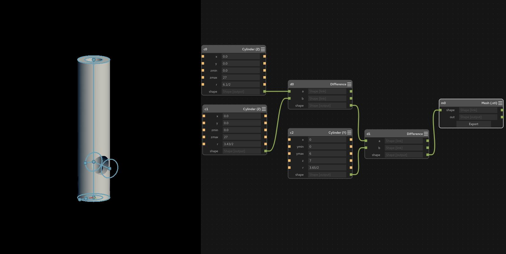

</p>

I used antimony because its parametric so I can change the diameters easily. And this proved to be quit handy as I got the best results after three tries. I used white ABS filament and I had to change the dimensions because the real dimensions was a bit less than the antimony dimensions. Below is stl preview of my design that can be downloaded from sketchfab.

<p align="center">
<iframe width="640" height="480" src="https://sketchfab.com/models/967976fa47704e8b8561e204c168a842/embed" frameborder="0" allowvr allowfullscreen mozallowfullscreen="true" webkitallowfullscreen="true" onmousewheel=""></iframe>
</p>

### ***The Build Plate***

Then we encountered another problem which is the build plate of the SRM-20, as the Z-axis can't reach the build plate with a big margin! Thus I used laser cut to cut 3 pieces of 12 mm acrylic then I used double tape to stick them together as shown below:

<p align="center">
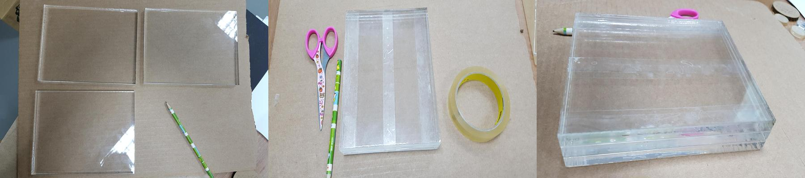  
  <center>I used thin double tape to stick the acrylic boards together</center>
</p>

Then I used double tape to stick them to the build plate of the machine.

<p align="center">
  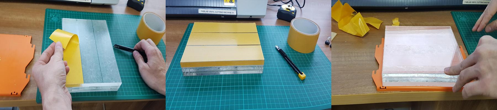  
  <center>Sticking the custom made build plate to the machine build plate</center>
</p>


Then we had to re-surface the build plate to make sure that it is even with respect to the machine Z axis because PCB milling is a delicate process and having uneven surface will results in breaking the milling bits so fast.

<p align="center">
<iframe width="560" height="315" src="https://www.youtube.com/embed/LopjydLbwhw" frameborder="0" allowfullscreen></iframe>  
</p>

We used the 6 mm flat end mill bit that comes with the machine to surface the build plate faster. I drew a simple rectangle with a dimensions of 20 cm by 15 cm using CorelDraw. Then we used Fabmodules to prepare the file for cutting. The below image shows the build plate after being surfaced:

<p align="center">

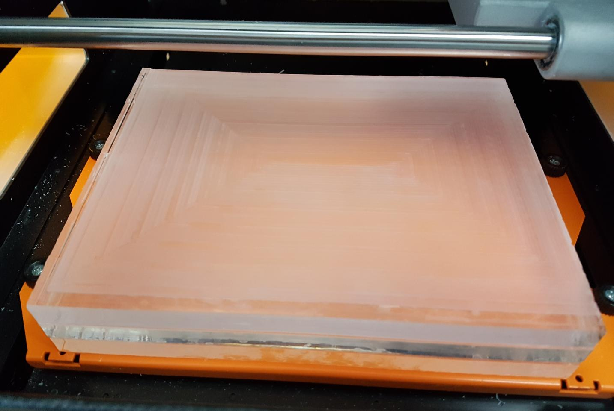

</p>


## ***Fabricating the ISP Board***
I used [Brian](http://fab.cba.mit.edu/classes/863.16/doc/projects/ftsmin/index.html) version as it has built in USB connection and he did a very good documentation. So I downloaded the PNG files of the traces and the outline which are shown in the below images:

<p align="center">

     
<center>Brian's ISP traces</center>

</p>

<p align="center">
     
  <center>Brian's ISP Outline</center>
</p>

Then I used the online version of [Fabmodules](http://fabmodules.org/) to generate the rml files for our Roland SRM-20 CNC machine. I used PNG as input format, then I choose Roland Mill (.rml) and PCB Traces (1/64) as we are using the 0.4 mm for milling the traces. The below picture shows the toolpath of the traces after pressing the 'calculate' button in fabmodules:

<p align="center">
  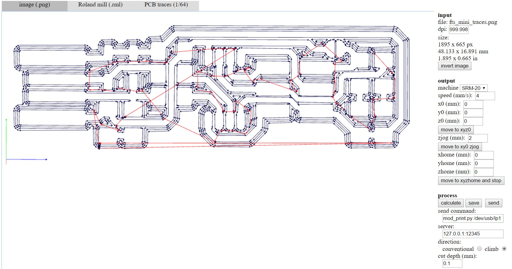   
    <center>toolpath of the traces</center>
</p>


I did the same thing for the outline of the board but I selected 1/32 outline this time. After that I downloaded the rml files and ran the VPanel for SRM-20 software from Roland. First I zeroed the X and Y axis then I zeroed the Z axis by making the bit close to the build plate, then I unscrewed it from the collet and made it touch the build plate. I want to mention that I broke 1 bit while I was leveling, because I was using the touch pad of the laptop while clicking continuously on the "move down" button so I learned to never use touchpad with SRM-20 instead I should always use the mouse. The below picture shows the interface of VPanel Software:

<p align="center">
  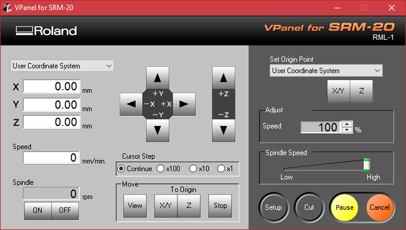   
    <center>Zeroing the X, Y and Z axis</center>
</p>

The above picture shows the zeros of the user coordinate system which can be changed by anyone, so to remember the actual coordinates I switched to the machine coordinates and took screenshots as shown below:


<p align="center">

     
  <center>Zeroing the X, Y and Z axis</center>


</p>


With the above coordinates, it does not matter if someone changed the user coordinates zeros, as I can always go to the same coordinates of the machine. Please note that the above screenshots are taken after milling the board for the sake of completing the documentation so they were not the exact actual coordinates that I used.

After that, I milled the board and the first result was not good at all as it resulted in breaking the second bit! due to the bad leveling of the Z axis as I moved it down a bit which made the bit mill deeper than required as it supposed to mill 0.1 mm only of the PCB substrate. Since then I did not break any milling bits, at least till now! The first try of milling the board is shown below:

<p align="center">
  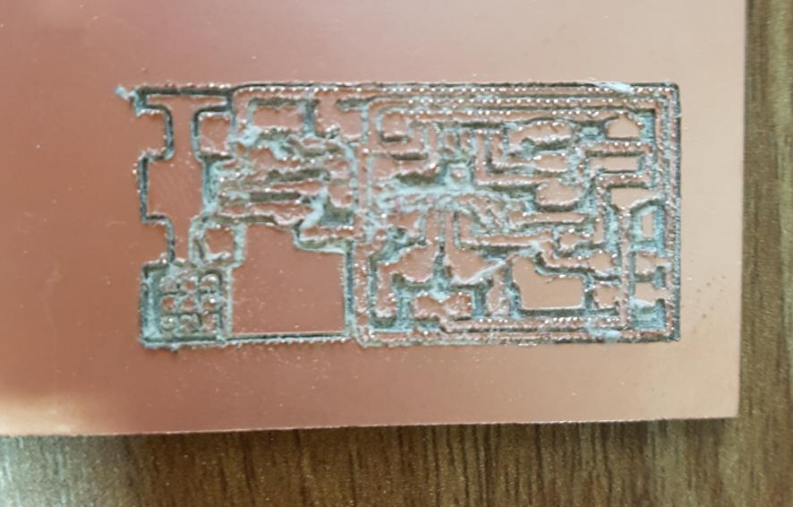   
  <center>a failed attempt!!!</center>
</p>

Finally, I was able to mill the traces properly as you can see in the below picture:

<p align="center">
  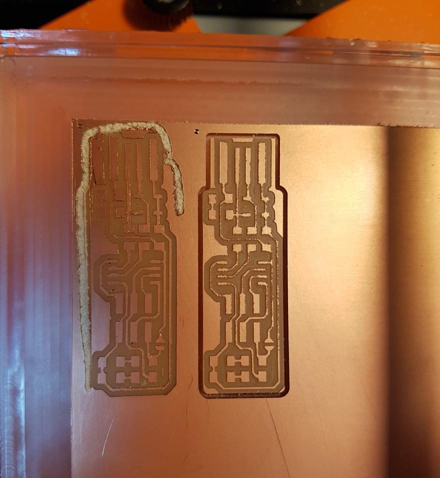   
  <center>Finally the traces turned out nicely (the left size), the traces only!</center>
</p>

As you can see in the above picture, the outline was extremely bad! You can say that I was not having a good day at all, it was late night and I was barely focused. The outline came out like this due to the bad leveling again as well as I was setting the "Cut Depth" to 0.6 mm in fabmodules, and I need to cut up to 1.7 mm which means the bit will pass 3 times to cut. So I re-zeroed that Z-axis again and set the cut depth to 0.4 mm and everything went smoothly as you see from the right side of the picture which shows the final board.

<p align="center">
  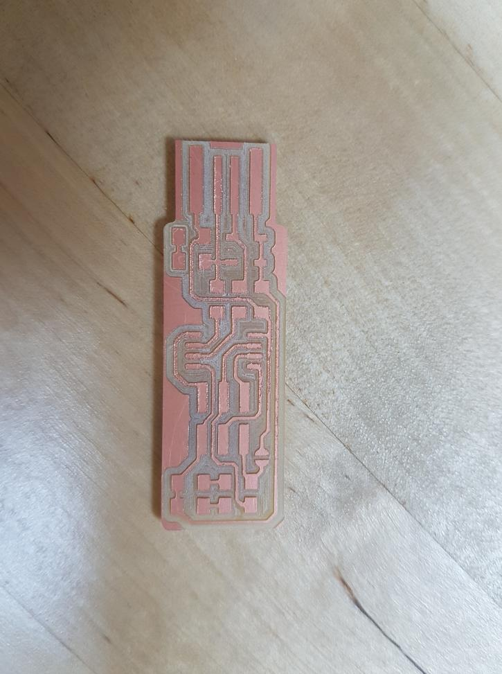   
  <center>The final board</center>
</p>

I just did another small mistake while taking out the cut board from the PCB as I took off all the PCB from the build plate which made the PCB bend and become unusable so our guru Mr Fransisco stuck the damaged PCB board to our white board and wrote "Don't" so no one will repeat the same mistake again!

<p align="center">
  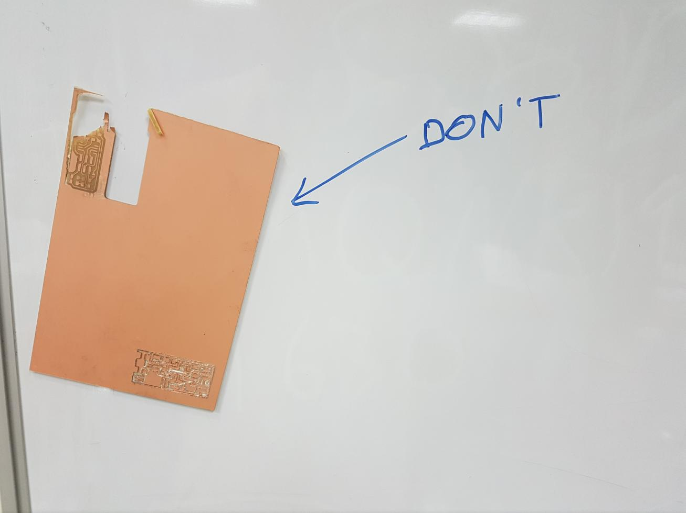   
  <center>Just don't!</center>
</p>

## ***Stuffing the ISP Board***

So now I am ready to solder it, the first thing I did was picking up the components as you can see below:

<p align="center">
  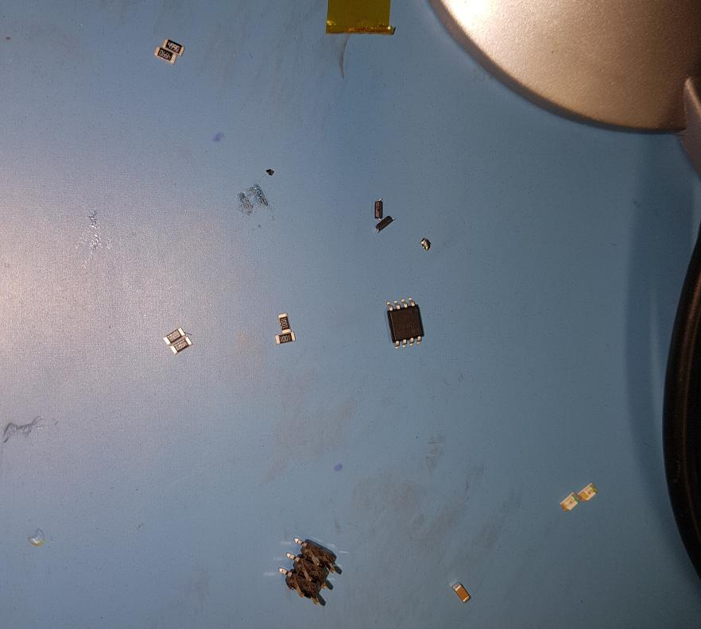   
  <center>The components of the ISP board</center>
</p>

As you can see above, it is not a very good way to prepare the SMD components for soldering, but it was really late night, around 1:00 AM and I was in hurry to solder it! The below picture shows the soldering setup of our fablab that I used to solder the components of the ISP board:

<p align="center">
  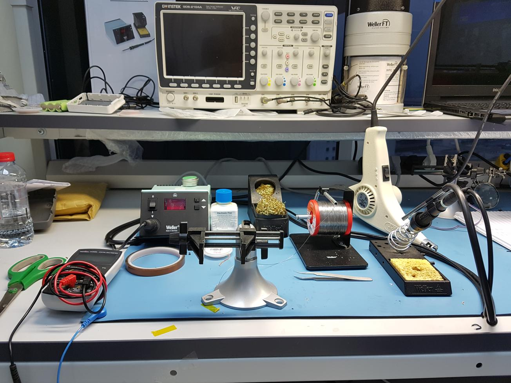   
</p>

The first thing I did was applying flux to the pads of the board as it helps a lot while soldering, or at least what I learned from the soldering video tutorials that I saw in youtube!

<p align="center">
  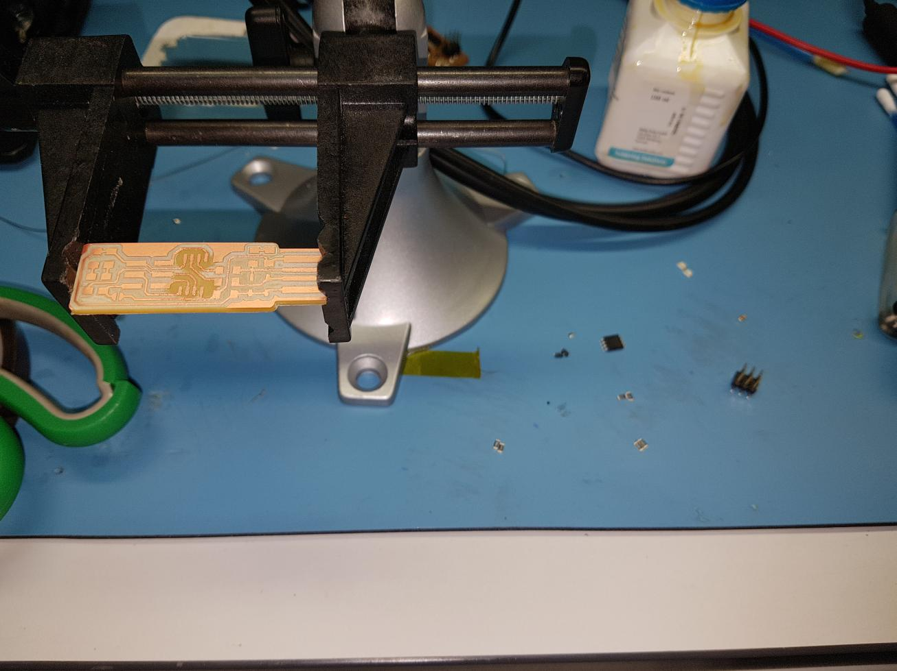
  <center>applying flux to the pads of the Attiny45</center>   
</p>

As you can see, I started by soldering the Attiny45 by applying flux to the pads. It was new experience to me to solder SMD microcontroller, the hard thing was aligning it to solder the first leg to mount it to the board so I can solder the rest of the legs easily.

Then I continued soldering the rest of the components as shown in the below image:

<p align="center">
  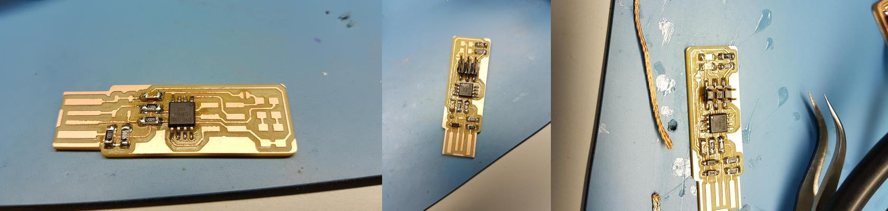
  <center>Soldering steps</center>   
</p>

As it is not my day at all, it turned out that I soldered the Attiny45 in wrong orientation...and which make it worse is that I totally forgot that we bought the soldering heat gun even though it was in the table just a bit to the right from me, all I needed to do to see it was to turn right. So I used the soldering wick and the soldering iron to remove the Attiny45 from its place, it was hard to remove it and not to mention, I broke one of the pads as you can see below:

<p align="center">
  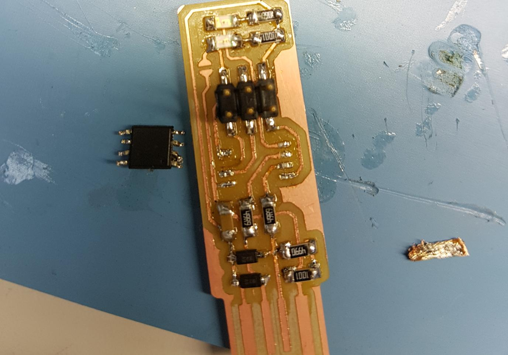
  <center>After removing the attiny, the broken pad is the second one from the left</center>   
</p>

So I had to re-solder it again and use a small jumper wire instead of the broken pad!

<p align="center">
  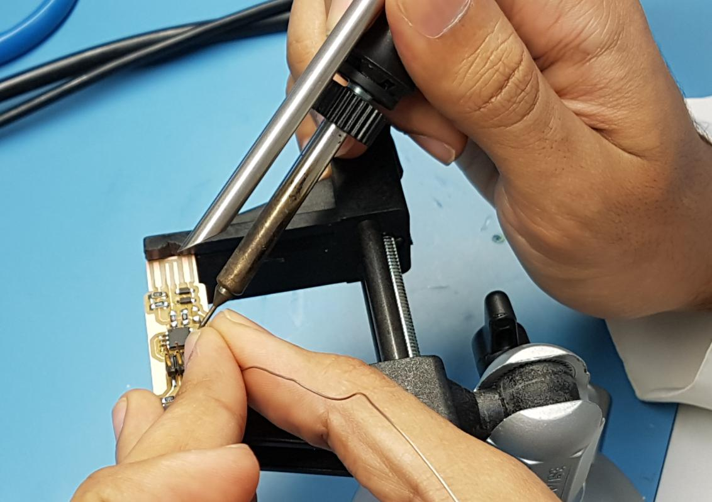
</p>

And finally I ended up with this board after removing the extra copper from the USB connector using a sharp knife.

<p align="center">
  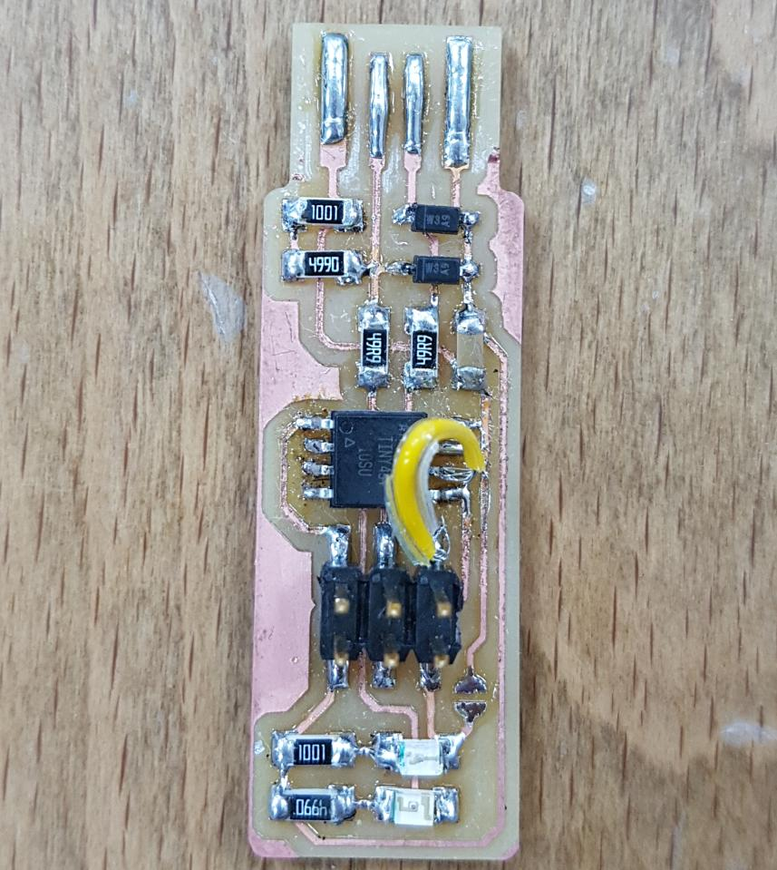
</p>

I wanted to fabricate a new board but Fransisco insisted in fixing my board first which what I did and maybe it does not look nice, but it works!

## ***Programing the ISP Board***

After finishing the board, it is time to program it to work as programmer! I followed Brian's instructions to end up with a working programmer.

The first thing was installing all the required dependencies, then downloading the firmware source code. Then I opened a terminal in the directory where the firmware was extracted, and I ran the make file by typing ```sudo make``` in the terminal. This will result in outputting the hex file as shown in the below figure:

<p align="center">
  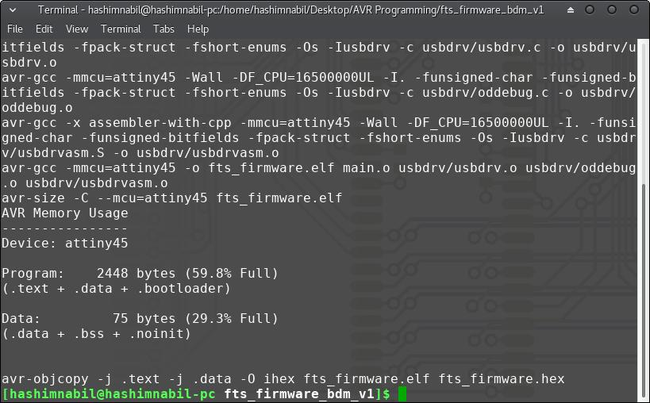
</p>

Then I used Mr Fransisco ISP programmer to program my ISP board.

<p align="center">
  
</p>

I flashed the ISP by running ```sudo make flash``` and it was done successfully as you can see below:

<p align="center">
  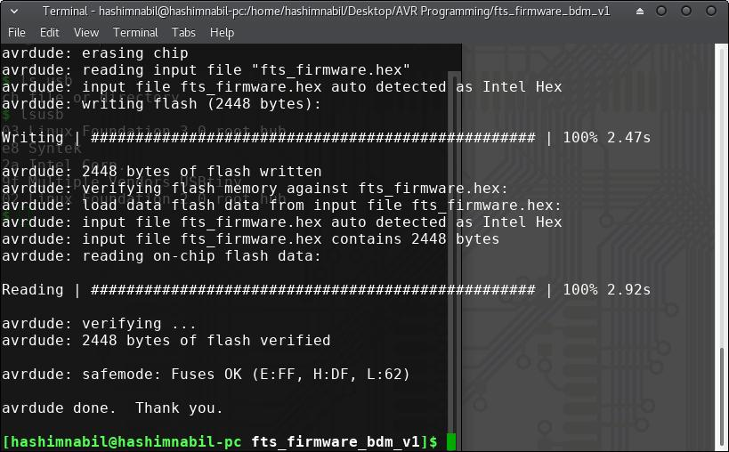
</p>

Then I ran the ```sudo make fuse```, after that, I tested the USB functionality by typing ```lsusb``` in the terminal and I was able to see "Multiple Vendors USBtiny" as you can see below:

<p align="center">
  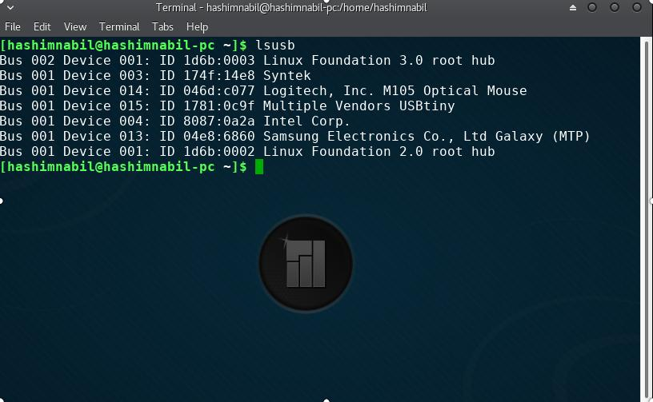
</p>

 and I finally I ran the command ```sudo make rstdisbl``` to blow the reset fuse, I tested the programmer by programming one of Fransisco's boards and it worked just fine!

## ***Update: Programmer Failed***

After being used by me and my colleagues I encountered a strange problem, the programmer won't program any board if I used the normal ISP connector to connect it to the board. I was getting the error shown below:

<p align="center">
  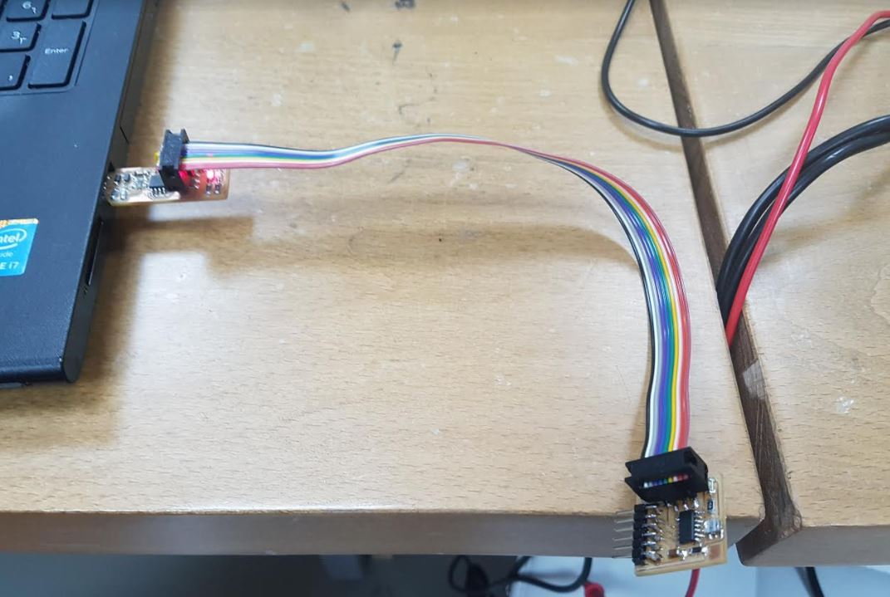
</p>

<p align="center">
  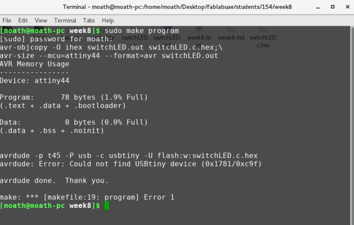
</p>

But when I use normal female wires that are connected from the ISP headers of the programmer to the ISP headers of the board I want to program, it just works! as you can see below:

<p align="center">
  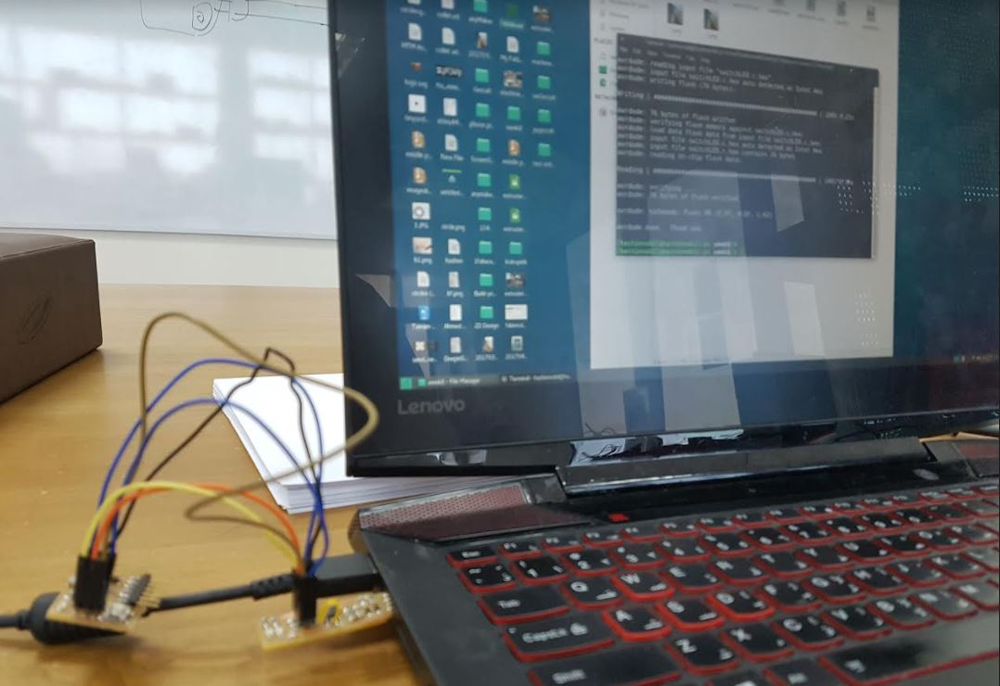
</p>

Fransisco suggested looking at the board using the microscope as the ISP cable might result in shortening something in the board. So I looked at the board using under the microscope and it turned out that some stings were coming from the jumper wire, so I cut them using the sharp knife and tried to program the board again and it worked just fine as you can see below:

<p align="center">
  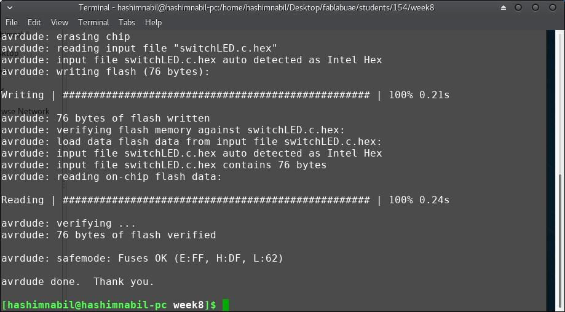
</p>

## ***Update: Programmer Died***

The jumper wire got cut off and I got bored of adding another wire again and to be honest, I wanted to make another programmer any way as I was unhappy with this programmer. So I made a new one with much better soldering and added a card at the bottom so it will stick to the USB port much better than before.

<p align="center">
  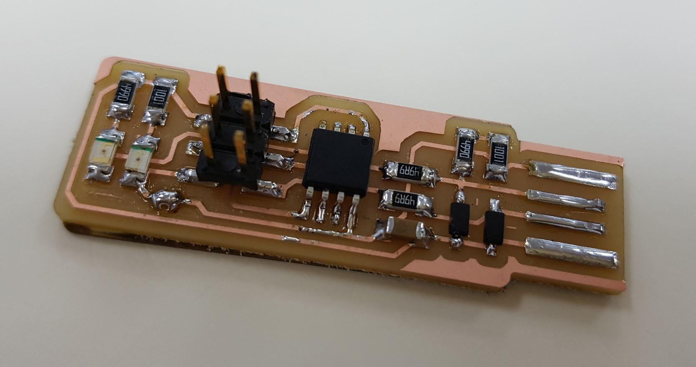
</p>

## ***What I have learned***

After many failing attempts, I learned to be more careful at doing the tasks as well as not to do delicate tasks at late night! and of course never use touch pad to control a CNC with bits that tends to break so fast as if they tell you "break me please".


### ***This Week's Files***

 - [collet adapter antimony](collet adapter.sb)
 - [Build Plate Surfacing DXF](roland bp.dxf)
 - [Build Plate Surfacing PNG](roland bp.png)
