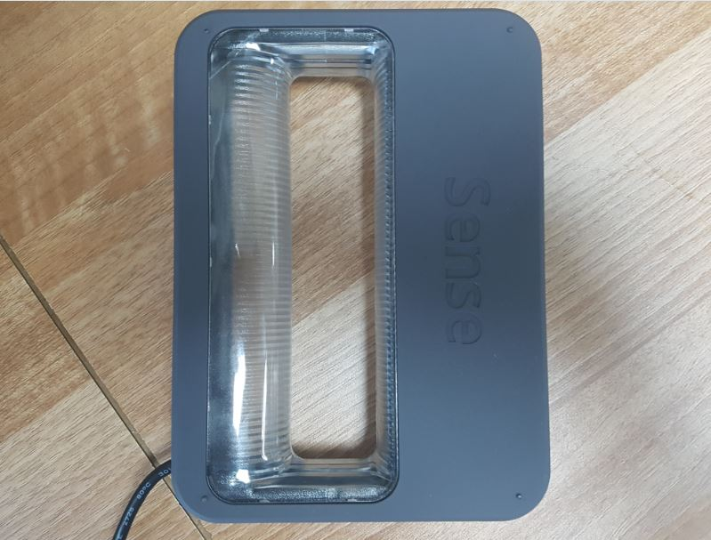
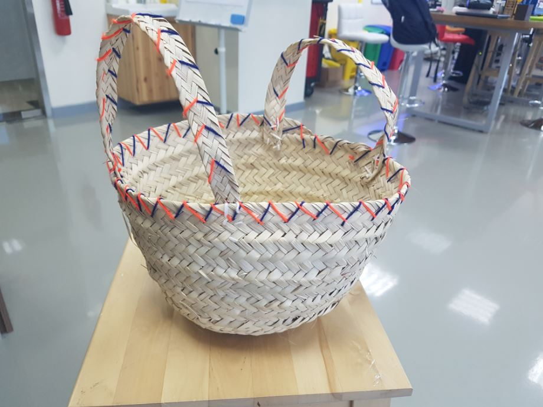
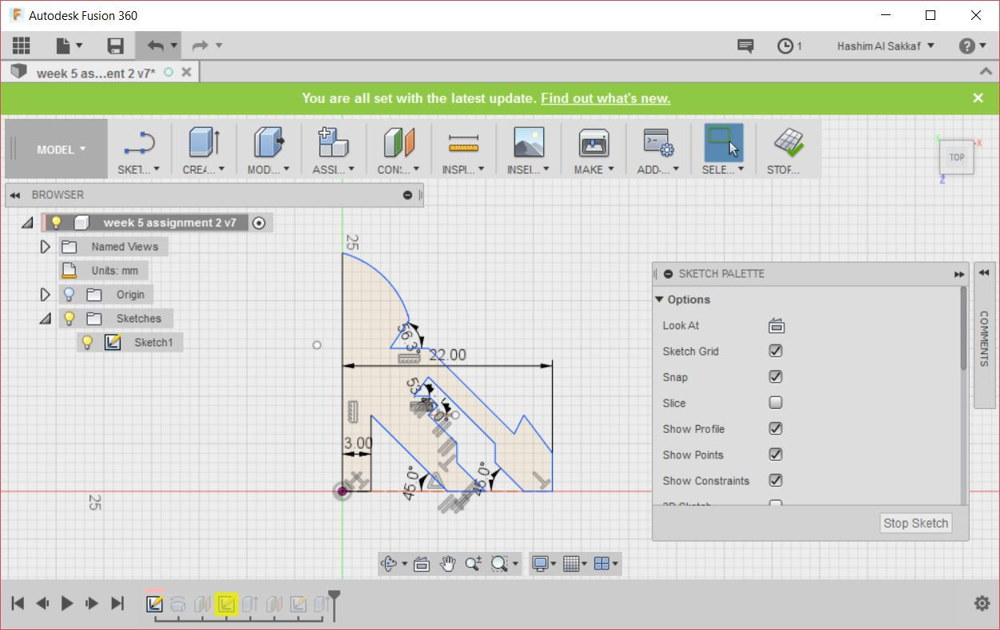
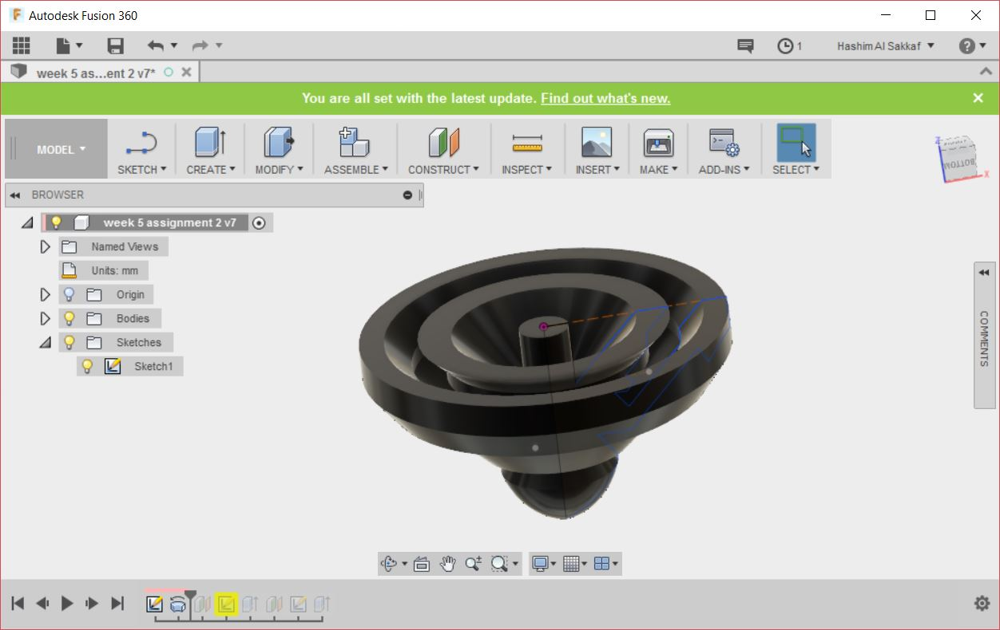
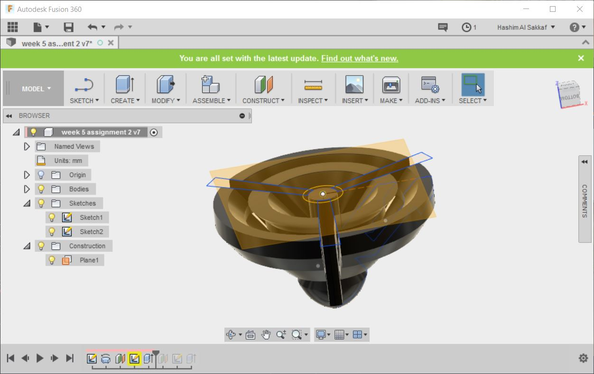
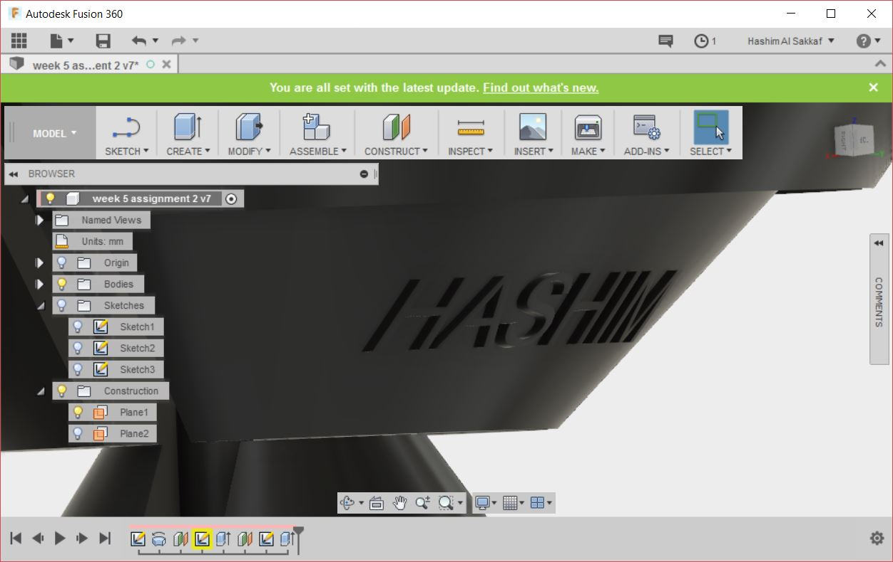
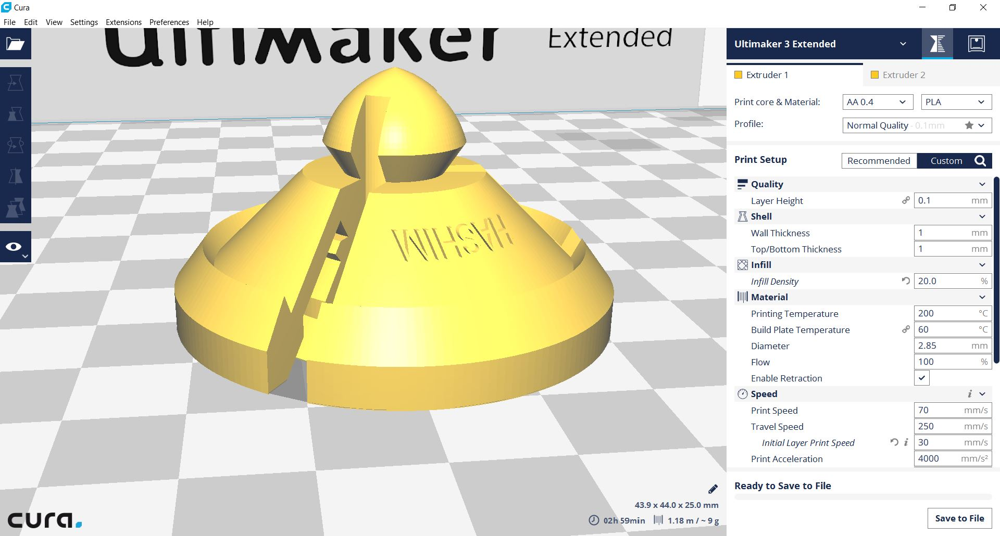
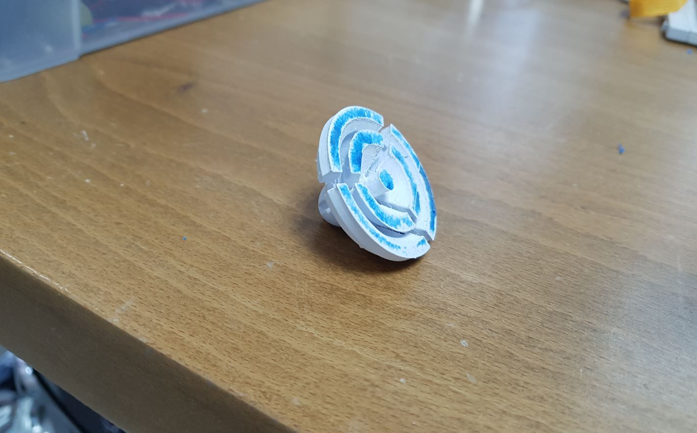
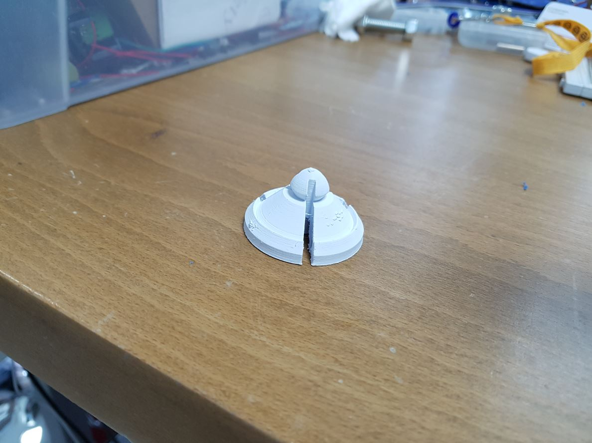

## ***Week 5: 3D Scanning and 3D Printing***

### ***Group assignment: 3D Printer Test***

We have 3 types of Ultimaker 3D Printer which are:

- Ultimaker 2: the printers that we use the most.
    - 20 micron resolution
    - Build Volume of 23 x 22.5 x 20.5 cm
- Ultimaker Original Plus: Needs Maintenance
    - 20 microns resolution
    - Build Volume of 21 x 21 20.5 cm
    - DIY KIT
- Ultimaker 3 Extended: Only one
    - 20 microns resolution
    - Build Volume of 21.5 x 21.5 x 30 cm

To test the 3D Printer, [Muadh Ali](http://archive.fabacademy.org/archives/2017/fablabuae/students/163/) downloaded a test [print](https://www.thingiverse.com/thing:704409) from thingiverse.com then he sliced it using Cura software with the following settings:

- 20 % infill.
- 50 mm/s printing speed.
- 120 mm/s travel speed.

He printed it with Ultimaker 2 3D printer with PLA filament and the results are shown below:

     
  
Picture by [Muadh Ali](http://archive.fabacademy.org/archives/2017/fablabuae/students/163/) 

I can see from the picture that the printer handled most of the details pretty well except some of the texts, the top of the pyramid and the conical shapes. Regarding overhangs, it handled all of them pretty fine, as all of them are above 45 degrees and we knew that Ultimaker 2 can handle overhangs with this angle before fabacademy. The lines came out good as well except the very thin ones. There are some stings of filaments around some of the parts of the print.

### ***3D Scanning***

I used sense 3D scanner to complete the 3D scanning assignment.

I scanned a traditional basket that is made of palm fronds and was used in the past to carry food specially dates as shown below:

     
  
a traditional basket

After scanning it, there was some holes in the output mess, specially from the bottom as it was not exposed to the scanner. Luckily the scanner software provides a tools for fixing theses issues which I did. The end results is shown below:

<iframe width="640" height="480" src="https://sketchfab.com/models/a0fef8d3cba547819c12d5f91f36c0e1/embed" frameborder="0" allowvr allowfullscreen mozallowfullscreen="true" webkitallowfullscreen="true" onmousewheel=""></iframe>

<a href="https://sketchfab.com/models/a0fef8d3cba547819c12d5f91f36c0e1?utm_medium=embed&utm_source=website&utm_campain=share-popup" target="_blank" style="font-weight: bold; color: #1CAAD9;">Traditional Basket</a>
by <a href="https://sketchfab.com/HashimNabil?utm_medium=embed&utm_source=website&utm_campain=share-popup" target="_blank" style="font-weight: bold; color: #1CAAD9;">HashimNabil</a>
on <a href="https://sketchfab.com?utm_medium=embed&utm_source=website&utm_campain=share-popup" target="_blank" style="font-weight: bold; color: #1CAAD9;">Sketchfab</a>

### ***3D Design and 3D Printing***

For this 3D Design and 3D printing, I decided to make a spinning top toy that can not be manufactured by subtractive manufacturing techniques. For this task, I used Fusion 360 Software.

I started with a sketching the cores sectional face of the spinning top, I made sure to make some sharp 45 cuts that goes inside the material in different directions so no subtractive tool can mill these features.

  
  
Cross sectional sketch of the spinning top

Then I revolved that sketch around its main line to end up with the shape shown below:

  
  
The shape after performing the revolve operation

After that, I made a 3 cuts around the center of the body to decrease the printing time as well as to show the features that are hidden by the outer wall of the object.

  

Finally, I added my name to one of the sides using "using extrude from object" feature.

  
  
After Adding the text

I exported the OBJ format of the design by opening the file in my A360 drive then exporting the OBJ format. Then I uploaded it to sketchfab as shown below:

<iframe width="640" height="480" src="https://sketchfab.com/models/46ce1c7f779b4491a149ccb445160f84/embed" frameborder="0" allowvr allowfullscreen mozallowfullscreen="true" webkitallowfullscreen="true" onmousewheel=""></iframe>

<a href="https://sketchfab.com/models/46ce1c7f779b4491a149ccb445160f84?utm_medium=embed&utm_source=website&utm_campain=share-popup" target="_blank" style="font-weight: bold; color: #1CAAD9;">Hashim Spinning Top</a>
by <a href="https://sketchfab.com/HashimNabil?utm_medium=embed&utm_source=website&utm_campain=share-popup" target="_blank" style="font-weight: bold; color: #1CAAD9;">HashimNabil</a>
on <a href="https://sketchfab.com?utm_medium=embed&utm_source=website&utm_campain=share-popup" target="_blank" style="font-weight: bold; color: #1CAAD9;">Sketchfab</a>

Then I slice it using Cura software as the slicing settings is shown in the below image:

  
  
Slicing settings for Ultimaker 3 Extended

I used blue application tape to increase the build plate adhesion of the 3D printer, as our Ultimaker 3 Extended needs maintenance as the nozzle tends to hit the top layer of the print as the layer counts increase which results in moving the part from the build plate. As you can see in the below picture, there are residuals of the blue application tape at the bottom of the print.

  
  
Residuals of the blue application tape can be seen at the bottom of the print 

I noticed also that the text did not print at all, maybe it was so small or maybe because of the malfunction of the printer.

  
  
Text did not print all

Finally, I attached a youtube video of me trying the spinning top:

<iframe width="560" height="315" src="https://www.youtube.com/embed/C9Ii2hJ9vXw" frameborder="0" allowfullscreen></iframe>

### ***Files of the Week***

- [Spinning Top Fusion360](spinning_top.f3d)
