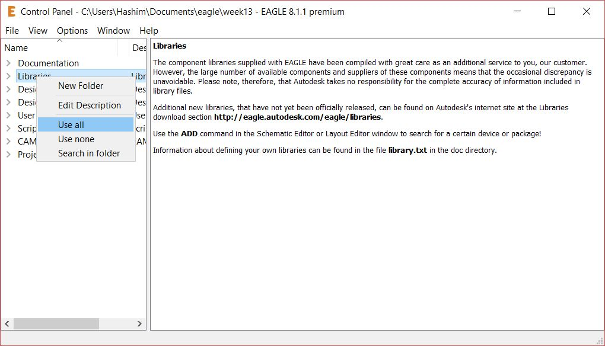
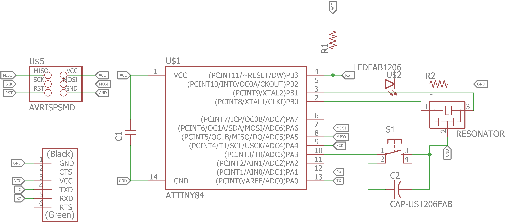
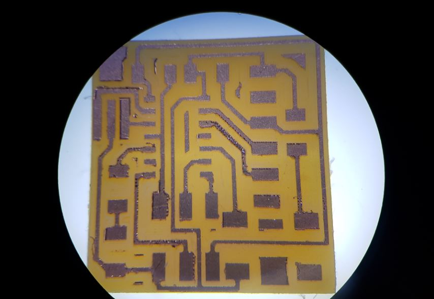
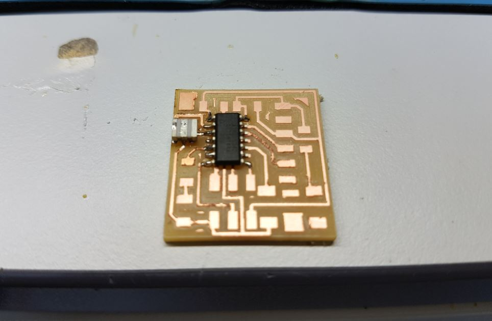
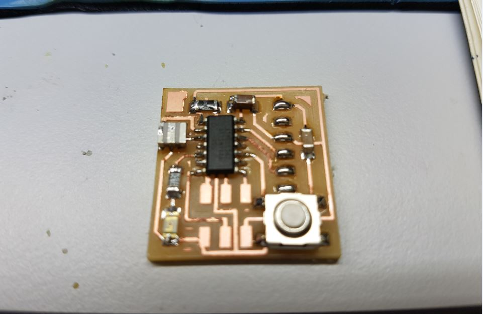
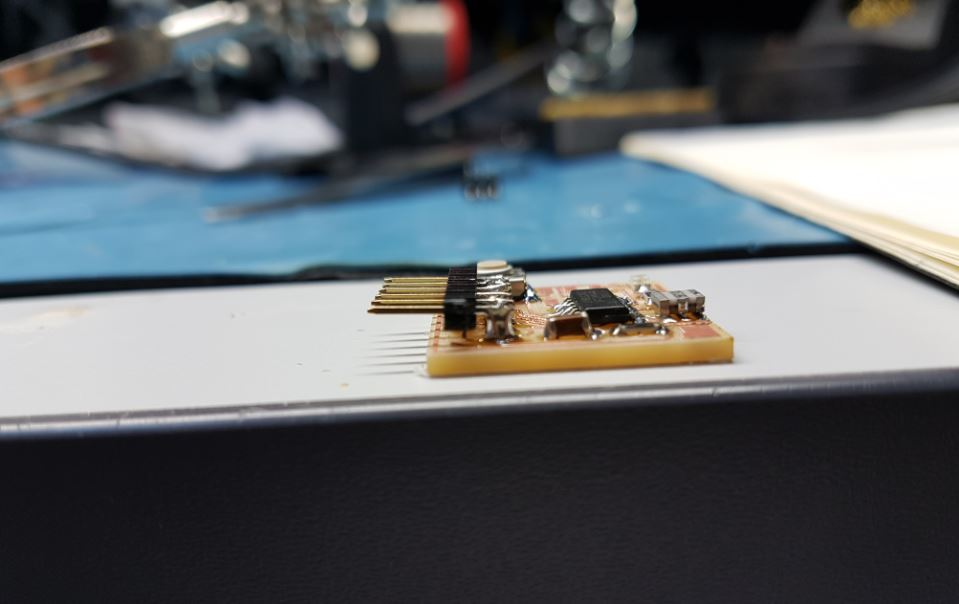
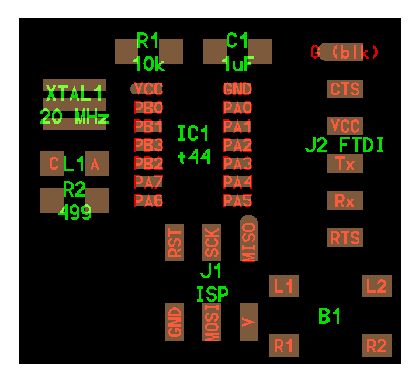
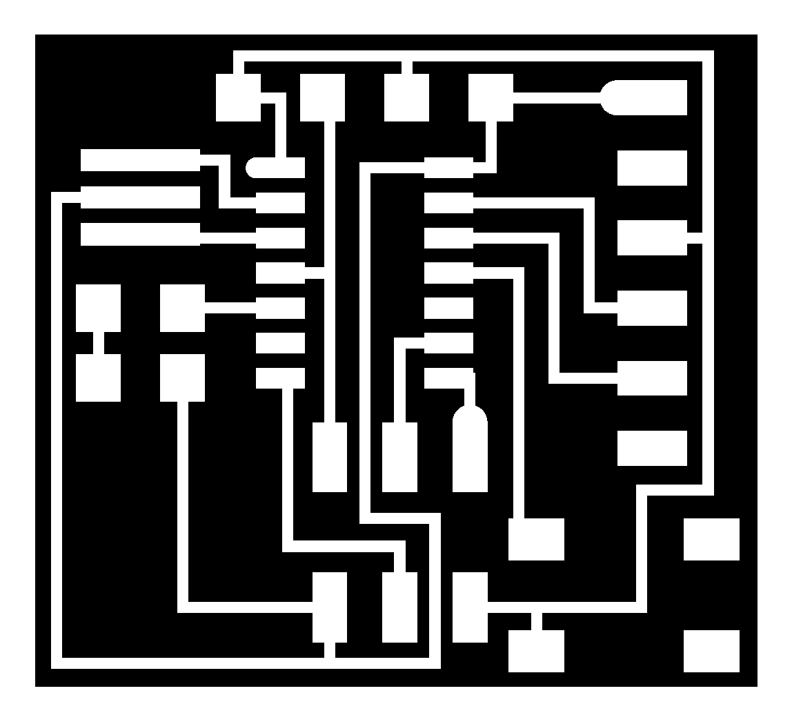

## ***Week 6: Electronics Design***  

This week project was about electronics design where we had to re-design the [echo-hello board](http://academy.cba.mit.edu/classes/embedded_programming/index.html#echo) and add at least a LED and a button to it.

I did two designs with two different software which are Eagle CAD that I am familiar with it, and [Kokopelli](https://www.mattkeeter.com/projects/kokopelli/) as it is used by Neil as well as our Guru Fransisco Sanchez. I wanted to try creating PCB with just code that is why I did the second design using Kokopelli!

### ***Hello Board - Eagle***

Eagle became part of Autodesk recently and I have an Educational Autodesk account so I got myself the premium version of Eagle for Free!

First of all, I downloaded the [Fab](http://academy.cba.mit.edu/classes/electronics_design/index.html) library of Eagle to get most of the footprints of the SMD components that we have. I already had [SparkFun](https://github.com/sparkfun/SparkFun-Eagle-Libraries) and [Adafruit](https://github.com/adafruit/Adafruit-Eagle-Library) Eagle libraries which proved to be very useful for me in the past.

Installing library in eagle is pretty straight forward as all I had to do is to download the library, copy it in lbr folder inside the Eagle folder, in my case in **"C:\EAGLE 8.1.1\lbr"** then activating the libraries in the Eagle software itself by right clicking on the ***"Libraries"*** tab then selecting ***"Use all"*** as shown below:

<p align="center">
     
   Using Libraries in Eagle
</p>

#### ***components***

My board consists of the following components:

1. Attiny 44
2. ISP Header
3. 10K ohm Resistor
4. 499 ohm Resistor  
The [LED](https://www.digikey.com/products/en?keywords=160-1169-1-ND) we used has a 30 mA continues current and the Attiny44 output high is 4.3V according to page 155 of the [datasheet](http://www.atmel.com/Images/Atmel-7701_Automotive-Microcontrollers-ATtiny24-44-84_Datasheet.pdf), so the required resistance will be `4.3/30m = 143 ohm` so I used the minimum resistor that is close to this value which is 499 ohm.
5. 8 MHz Resonator
6. FTDI Connector
7. 1 uF Capacitor
8. 0.1 uF Capacitor
9. Push Button (6 mm x 6 mm)
10. LED 1206

#### ***Schematic***

The first step in PCB design with eagle is to create a new project then to create the schematic. The schematic is meant for inserting all the components footprints as well as making all the electrical connections between them, so I inserted all my components then I made the connection as shown below:

<p align="center">
     
   Schematic
</p>

#### ***Board Design***

To start making the actual PCB design, I switched to the Board editor in eagle by clicking the "Generate/Switch to Board" tap as shown below:

<p align="center">
  
PCB Design
</p>

My board design is based on Neil's boards, as he puts the ISP just bellow the Attiny44 which saves a lot of space! I used 16 mill trace width to trace the components with 16 mill clearance in DRC settings because we use the 1/64 inch/ 0.4 mmm drill bit for milling the traces which equals to almost 0.016 inch (0.0157 to be exact) or 16 mill. Then I ran the Design Rule Check with to check for errors as shown below:

<p align="center">
     
   DRC clearance Rules
</p>

<p align="center">
     
DRC Results
</p>

As seed above, there are no DRC errors which means the board is ready for milling. To do so, I prepared the traces image as well as the outline image by first exporting the PCB png image from Eagle by hiding all the layers in the "Layers Settings" except Top, Pads and Dimensions layers as shown below:

<p align="center">
     
Layers Display Settings in Eagle
</p>

Then I exported the png image from file>export>image with a 1000 dpi, window and monochrome (black and white) as shown below:

<p align="center">
     
Exporting Image of the Board
</p>

I checked the window area so I can have a lot of white space around the PCB to be able to edit it with comfort in GIMP. After that, I used GIMP software to prepare the board for Fabmodules.org. I made a short video showing my workflow of preparing the PCB to be milled from Eagle to Fabmodules.org.

<p align="center">
<iframe width="560" height="315" src="https://www.youtube.com/embed/xP_CRNY5m34" frameborder="0" allowfullscreen></iframe>
</p>

My board dimensions are 24 x 25.19 mm which is very small I guess!

#### ***Board Fabrication***

Similar to [week 4](http://archive.fabacademy.org/archives/2017/fablabuae/students/154/week4/week4.html), I used Roland SRM-20 CNC machine to mill my board. Even though all of our milling bits were broken! we managed to mill most of our PCBs with them! For my good luck, the bit I used was a bit better than the rest! so the board came our pretty good, almost as if it was milled with unbroken bit!

<p align="center">
     
The board after being milled
</p>

<p align="center">
     
A very small echo-hello world design!
</p>

As you can see, the board is pretty small, it is only 23.2 mm by 24.3 mm as I tried to make it as small as possible!

To avoid problems after soldering as re-soldering this small board where components must be soldered in specific order otherwise it will be pretty hard to solder, this a drawback of the small size, I put it under the microscope to check for short circuits as shown below:

<p align="center">
     
The board under the microscope
</p>

Then I prepared the components but unlike week 4, I organized them this time!

<p align="center">
     
Preparing the components
</p>

You can see that the LED is not mentioned in the above list as I forgot to include it but I soldered it as it is the only output of my board!

As my board size is very small I needed to solder in specific order to avoid difficulties while soldering so I started by soldering the Attiny44 then the Resonator followed by all the resistors, the LED and the capacitor, then the push button and the ISP headers and finally the FTDI connector.

<p align="center">
     
Soldering the Attiny44 first
</p>

<p align="center">
     
After soldering the Attiny44, all resistors, capacitors, resonator and the push button
</p>

<p align="center">
     
Side view of the final board
</p>

As seen in the above picture, I used the de bouncing capacitor to hold the FTDI connectors then I added excessive amounts of solder in each pad of the FTDI connectors pads as well as the legs of the connector itself which resulted in holding the FTDI connector in almost 90 degree.

The below pictures shows the final fabricated board!

<p align="center">
     
Final board
</p>

<p align="center">
     
Hero shot of the final board!!!
</p>

After finishing this board, I appreciated the advice of Mr Fransisco to use GIMP to edit the image exported from Eagle CAD as it was very useful software and the steps of preparing the images are pretty straight forward even though it was hard for me to get used to it at the beginning. I also liked the Fab footprints of the 1206 components from the Fab eagle library as passing the trace in between the components pads helps a lot in decreasing the size of the board!

### ***Hello Board - Kokoopelli***

It is my first time trying PCB design using nothing but code! I thought it will be extermly hard at the beginning, but Fransisco gave us a small demo about it and it was somehow easy to use.

I started by downloading [Neil's hello.ftdi.44.cad](http://academy.cba.mit.edu/classes/embedded_programming/hello.ftdi.44.cad) then I modified it by adding a push button and LED. Modifying a ready board is much easier than creating one from the scratch. I also noticed that the file is self contained so all the classes are defined in the same code.

The first thing I did was defining the board dimensions by changing the parameters found in this section of the code:

```
w = .016  
width = 1.03  
height = .93  
mask = .004  
x = 1  
y = 1  
z = -.005  
d = .06  
```
The board dimensions are equivalent to 26.38 x 23.96 mm and is a bit bigger compared to the eagle board I designed before. I also figured out that I could made the Eagle board much smaller is I connected the 1 uF capacitor in the same configuration of the Kokoopelli board.

Then I added the components, most of them were added with the original file such as the Attiny44, the FTDI headers, the ISP headers, the resonator, the 1 uF capacitor and the 10K ohm resistor. So I added a button, LED and its pull down resistor.

<p align="center">
     
  <center>After adding the components</center>
</p>

Then I made the connections using the following commands:

`pcb = wire(pcb,w,
   IC1.pad[3],
   XTAL1.pad[3])`  

For example this command wire the resonator pad 3 to pin 3 (PB1) of the Attiny44. And while creating the wires, the horizontal line will be created then the vertical line will be created. In addition, we can insert as much intermediate points as we want as stated by Fransisco in this [tutorial](http://fabacademy.org/archives/content/tutorials/07_Electronics_Design/kokopelli/kokopelli_101.html). I used this feature to connect the VCC pin of the FTDI connector to the push button to decrease the size of the PCB.

```
pcb = wire(pcb,w,
   J1.pad[2],
   point(b1.pad[4].x-0.1,b1.pad[4].y+0.07,z),
   point(J2.x+.08,J2.pad[3].y,z),
   J2.pad[3])
```
The following picture shows the board after finishing the routing of the traces. I want also to state that the ISP, FTDI, crystal, 10K resistor and the 1uF capacitor were already routed, I just moved the FTDI to the right and routed the rest of the components such as the button and the LED and its pull down resistor.

<p align="center">
     
  <center>Final board</center>
</p>

After finishing the design, I exported the board image, traces and outline by commenting and uncommenting these functions in the top of the code:

```
output = "traces, labels, and exterior"
#output = "traces and exterior"
#output = "interior"
#output = "exterior"
#output = "traces"
#output = "holes"
#output = "solder mask"
```
`output = "traces, labels, and exterior"` this command outputs the whole board with the traces, labels and exterior as shown in the previous picture.

`output = "traces and exterior"` this outputs the traces ready to be milled in [Fabmodules](fabmodules.org) as shown below:

<p align="center">
     
  <center>Traces for fabmodules</center>
</p>

`output = "exterior"` this outputs the outline of the board as shown below:

<p align="center">
     
  <center>Outline of the board</center>
</p>

Finally I exported the 2 images with a resolution of 40 mm/pixel which is equivalent to 1016 ppi which more than enough for fabmodules. I used this online [conventor](http://www.endmemo.com/sconvert/pixel_mmppi.php) to convert from ppi to ppmm. I did not fabricate the Kokoopelli board as I had to fabricate only one board.

In the end, I am glad that I tried Kokoopelli and I think I will work more with it after fabacademy. It is fast and easy to use and most of all cool! making PCB with code is something! However, it is not standard among the major community so I will be using eagle as well.

## ***Files of the Week***  

* [Eagle Schematic](Electronic Design.sch)
* [Eagle Board](Electronic Design.brd)
* [Hello Board-Eagle Traces Image](Eagle Traces.png)
* [Hello Board-Eagle Outline Image](Eagle Outline.png)
* [Hellow Board-kokopelli.CAD](koko_hello.cad)
* [Hellow Board-kokopelli.Board](koko_board.png)
* [Hellow Board-kokopelli.Traces](koko_traces.png)
* [Hellow Board-kokopelli.Outline](koko_outline.png)
