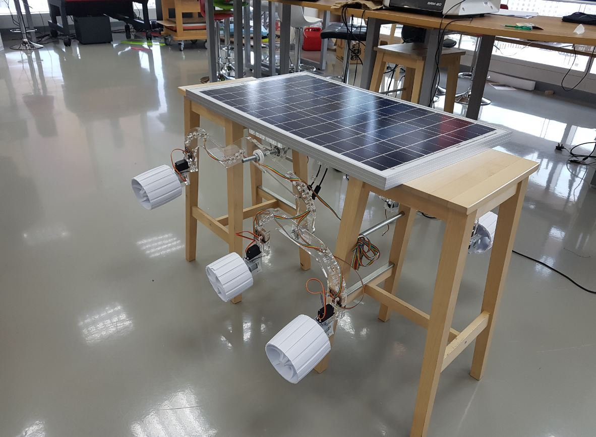
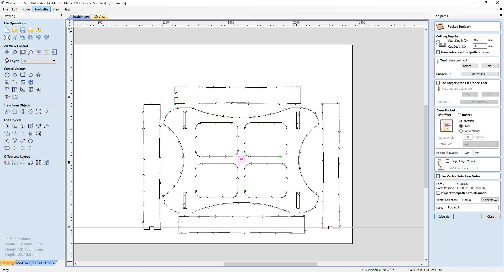
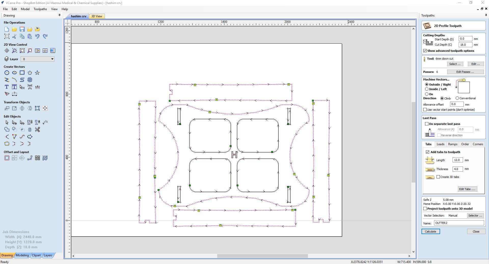
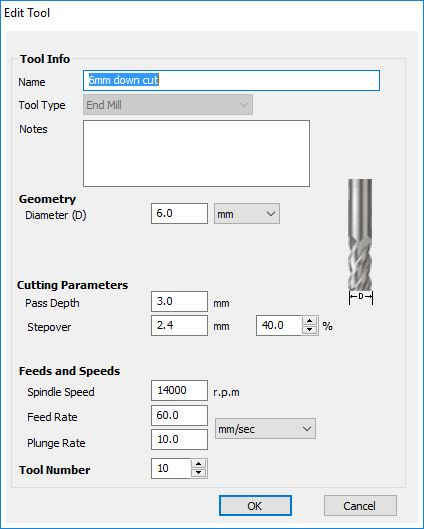
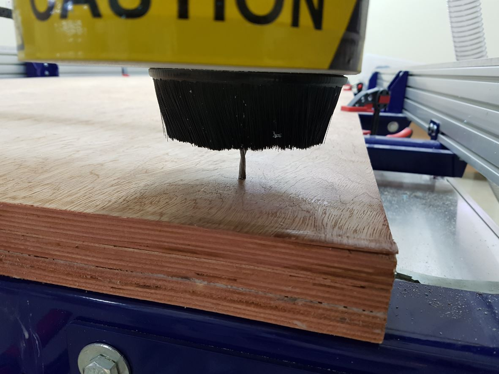
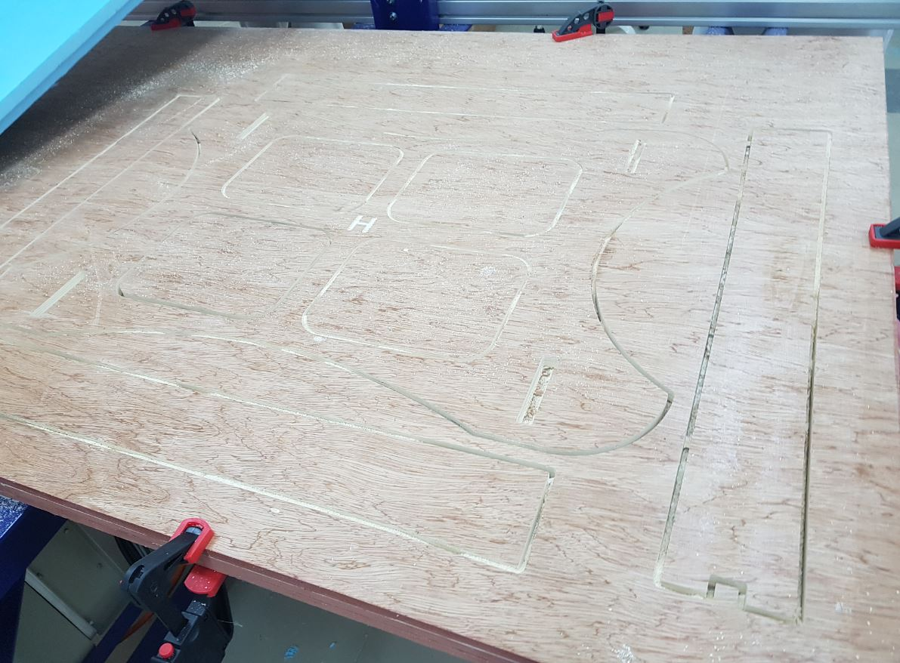
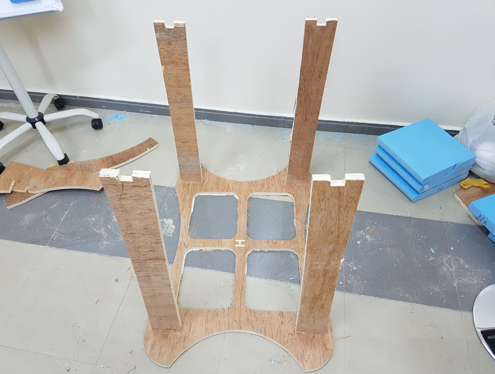

## ***Week 7: Computer Controlled Machining***

### ***The Assignment***
To design and machine something big using computer controlled machining. I used Shopbot PRS Alpha that we have at FabLab UAE to complete this assignment.

### ***The Design***
I designed a holder for my final project, [Fab Rover](http://archive.fabacademy.org/archives/2017/fablabuae/students/154/final_project/finalproject.html) as I was using chairs to raise it up so I can program the motors or assemble the frame as seen in the image below:

     
  
Fab Rover Mounted on two chairs

So I used fusion 360 to design a custom holder for the rover. It consists of 5 parts, one main body and four legs. I used dogbones for the holes where the legs will be assembled to as this techniques is very famous in CNC world as it helps in easing the assembly operation.

<iframe width="640" height="480" src="https://sketchfab.com/models/b88f2959dd534adf85223a668256df92/embed" frameborder="0" allowvr allowfullscreen mozallowfullscreen="true" webkitallowfullscreen="true" onmousewheel=""></iframe>

<a href="https://sketchfab.com/models/b88f2959dd534adf85223a668256df92?utm_medium=embed&utm_source=website&utm_campain=share-popup" target="_blank" style="font-weight: bold; color: #1CAAD9;">Fabrover Holder</a>
by <a href="https://sketchfab.com/HashimNabil?utm_medium=embed&utm_source=website&utm_campain=share-popup" target="_blank" style="font-weight: bold; color: #1CAAD9;">HashimNabil</a>
on <a href="https://sketchfab.com?utm_medium=embed&utm_source=website&utm_campain=share-popup" target="_blank" style="font-weight: bold; color: #1CAAD9;">Sketchfab</a>

### ***Fabrication***

To fabricate the design, first, I saved the two main sketches which are the main support and the leg as DXF format. Then I opened [VCarve Pro](http://www.vectric.com/products/vcarve.htm) software that comes with the shopbot to generate the toolpath. First, I started with the pocket toolpath, of the letter "H" that is in the center of the main board. Then I generated the toolpath of the inside cuts of the dog bone joints as well as the unnecessary areas that are aimed to decrease the weight of the item.

After opening VCarv, I sat up the material dimensions to be 2440 x 1220 x 18 mm then I loaded the DXF file. I needed to join some open vectors before placing the parts in their place on the material. Then I started by the pocket toolpath of the text as shown below:

     
  
Pocket toolpath

Then I made a toolpath for the inner cuts as well as the outer cuts. For the outer cuts, I added taps that help in keeping the cut piece in its place while the tool is cutting but I did not do that for the inner cuts as I don't care about these pieces.

     
  
Inner and Outer toolpaths

I used 6 mm down cut bit with 14000 RPM, 60 mm/s feedrate speed, 3 mm pass depth and 2.4 mm stepover for all the toolpaths as shown below:

     
  
Tool Settings

I used 17.6 mm plywood as the raw material of my project. I started with mounting it to the base of sacrificial layer of the machine using clamps. Then I centered the tool at the edge of the machine and with an offset from the edges so it will not hit the clamps.

     
  
Centering the tool

Then I switched on the machine and pressed the "Reset Button" and loaded the toolpath file from VCARV to the machine and pressed the "cut part" button, then I switched on the spindle and started a dry run where the machine was moving on the air just to ensure that the tool will not hit any of the clamps. After that I started the real job as you can see in the videos below:

<iframe width="560" height="315" src="https://www.youtube.com/embed/cfvlyHahUos" frameborder="0" allowfullscreen></iframe>

The below picture shows the model after being cut:

     
  
After finishing the cutting operation

### ***Assembly***

After cutting the parts, I sanded them using the sanding machine to remove the residuals and make them smoother, then I assembled them as shown below:

     
  
Final Assembly

### ***Files of the Week***

- [Rover Holder](rover_holder.f3d) fusion360 file
- [Rover Holder](rover_holder.crv) VCarv file
